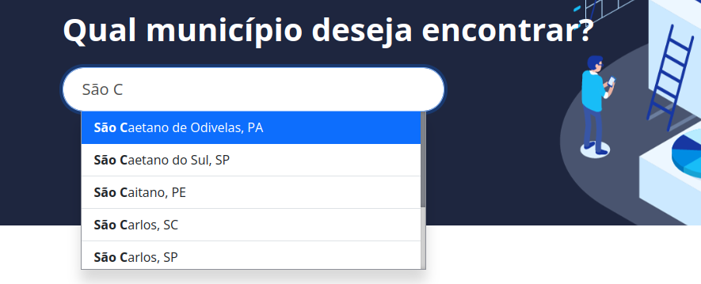

# SCC0957 - Prática em Ciência de Dados II

Este repositório possui os scripts, em formato Python Notebook (IPynb), utilizados para aquisição e análise dos dados do nosso projeto na disciplina.

## Links Rápidos para Acesso dos Notebooks pelo Google Colab:
1. Análise Exploratória dos Investimentos de cada Cidade: [](https://colab.research.google.com/github/Rafaelsoz/Pratica-Ciencia-Dados-II/blob/main/Exploratoria_Investimentos.ipynb)
2. Scrapper utilizado para extrair os dados da plataforma Inteli.Gente: [](https://colab.research.google.com/github/Rafaelsoz/Pratica-Ciencia-Dados-II/blob/main/Scrapper%20(PCDII).ipynb)
3. Análise Exploratória do Número de Pessoas em cada Nível Educacional de cada Cidade: [](https://colab.research.google.com/github/Rafaelsoz/Pratica-Ciencia-Dados-II/blob/main/RAIS_ESC_FREQ%20(PCDII).ipynb)
4. Análise Exploratória da Renda em cada Setor Industrial de cada Cidade: [](https://colab.research.google.com/github/Rafaelsoz/Pratica-Ciencia-Dados-II/blob/main/RAIS_RENDA%20(PCDII).ipynb)

## Resumo das Análises

#### 1. Análise Exploratória dos Investimentos de cada Cidade
Resumo da Análise

#### 2. Scrapper utilizado para extrair os dados da plataforma Inteli.Gente
Explicação do Scrapper

## Documentação

### Escolha do Tema e Conjunto de Dados - 08/08/2024
Optamos explorar a relação entre o nível de maturidade econômica de um município, calculado com base em indicadores como acesso à água, transporte e tecnologia, e seus dados de investimento público, emprego e  renda.

<p align="center">
  
  <br>
  <a>Fonte: </a>
  <a href="https://inteligente.mcti.gov.br/municipios/sao-carlos-sp">https://inteligente.mcti.gov.br/municipios/sao-carlos-sp<a/>
</p>

### Web-Scraping e Download dos Conjuntos de Dados Iniciais - 15/08/2024

Para obter os dados necessários, realizamos webscraping dos dados de maturidade, juntamente com dados espaciais como código, nome, latitude e longitude dos municípios. Diferentemente dos demais dados, que estavam disponíveis em arquivos CSV.

Para listar os códigos de cada cidade disponível no banco de dados da plataforma, utilizamos o end-point: 
<br>
```https://inteligente-backend.mcti.gov.br/api/cities/autocomplete```
<br>
junto do parâmetro de requisição GET ```term``` que é sobrecarregado com os caracteres que o usuário digita no campo de busca da plataforma.

<p align="center">
  
  <br>
  <a>Fonte: </a>
  <a href="https://inteligente.mcti.gov.br/">https://inteligente.mcti.gov.br/<a/>
</p>

```json
[
    {
        "id": 1507102,
        "friendlyName": "sao-caetano-de-odivelas",
        "result": "São Caetano de Odivelas, PA"
    },
    {
        "id": 3548807,
        "friendlyName": "sao-caetano-do-sul",
        "result": "São Caetano do Sul, SP"
    },
    {
        "id": 2613107,
        "friendlyName": "sao-caitano",
        "result": "São Caitano, PE"
    }
    ...
]
```
*Exemplo de Resposta da API da plataforma Inteli.Gente no endpoint ```autocomplete```*

Esse end-point é utilizado pela plataforma para sugerir opções de cidades na hora da busca, enquanto o usuário digita. Para catalogar todas as cidades disponíveis no banco de dados da plataforma, o script pesquisa todas letras do alfabeto, de A até Z, e extrai as keys ```result``` e ```friendlyName``` para cada um dos resultados. 

Após a aquisição dos metadados de todas as 5570 cidades do Brasil, utilizamos o end-point: 
<br>

```https://inteligente-backend.mcti.gov.br/api/cities/{codigo}```

Onde o parâmetro ```codigo``` se refere a chave ```friendlyName``` nos metadados de cada cidade. A resposta dessa requisição retorna várias informações mais gerais sobre a cidade, como latitude e longitude, estado, região, nível de maturidade geral, e também todas as informações sobre a cidade disponíveis na plataforma.

```json
{
  "code": 3548906,
  "friendlyName": "sao-carlos-sp",
  "name": "São Carlos",
  "evaluated": false,
  "stateAbbr": "SP",
  "stateName": "São Paulo",
  "regionAbbr": "SE",
  "regionName": "Sudeste",
  "group": "2C",
  "cluster": "7",
  "internalGroup": "Grupo 2",
  "level": 4,
  "latitude": -22.0174,
  "longitude": -47.886,
  "characterization": [
    {
      "code": "i4003",
      "sourceVersion": 3,
      "weight": 0,
      "value": 254857,
      "minValue": 0,
      "maxValue": 0,
      "level": 0,
      "transfValue": 0,
      "valueExists": 1,
      "digits": 0,
      "outlier": false
    },
    {
      "code": "i4038",
      "sourceVersion": 3,
      "weight": 1,
      "value": "Capital Regional C",
      "minValue": "",
      "maxValue": "",
      "level": 0,
      "transfValue": 0,
      "valueExists": 1
    }
    ...
  ]
  ...
}
```
*Exemplo de Resposta da API da plataforma Inteli.Gente no endpoint ```cities```*

Para compreendermos o que cada valor na chave ```code``` significa, utilizamos o end-point da API:
<br>

```https://inteligente-backend.mcti.gov.br/api/cities/score/labels```

Esse end-point retorna uma tabela com dados de cada valor que a chave ```code``` pode assumir, incluindo o nome em linguagem natural da variável e uma descrição para explicar o que os valores dessa chave representam.

|  Chave  | Título                      | Descrição                                                                                                                                                                                                                                                                                                                                                                                                                                                                                                                                                                                                                                                                                                            |
|----|----------------------------|------------------------------------------------------------------------------------------------------------------------------------------------------------------------------------------------------------------------------------------------------------------------------------------------------------------------------------------------------------------------------------------------------------------------------------------------------------------------------------------------------------------------------------------------------------------------------------------------------------------------------------------------------------------------------------------------------------------------|
| d4 | Sociocultural              | Avalia a proteção do bem-estar das pessoas de maneira equitativa, com redução das desigualdades socioespaciais, acesso à informação, inclusão e letramento digital, bens e serviços urbanos essenciais. Tem foco no respeitar à identidade e à diversidade sociocultural local. Essa dimensão avalia os seguintes tópicos:  1) Educação; 2) Saúde; 3) Gestão de desastres; 4) Inclusão digital; 5) Segurança pública; 6) Cultura; 7) Participação pública; e 8) Inclusão social.                                                                                                                                                                                                                                       |
| d2 | Econômica                  | Avalia o potencial de gerar renda e emprego para a subsistência das pessoas e o desenvolvimento inclusivo da economia urbana local. Tem foco no acesso à infraestrutura urbana e de TIC, a geração de oportunidades econômicas pelo uso das TICs nas cidades e a promoção da economia criativa e compartilhada. Essa dimensão avalia os seguintes tópicos: 1) Água e esgoto; 2) Resíduos sólidos; 3) Infraestrutura de conectividade; 4) Habitação; 5) Dados abertos; 6) Inovação; 7) Serviços públicos on-line; 8) Transporte; 9) Urbanização; e 10) Sistemas e tecnologias para gestão urbana.                                                                                                                       |
| d6 | Capacidades Institucionais | É a dimensão que avalia as capacidades institucionais para a transformação da cidade em uma cidade inteligente levando em conta ações-chave da administração pública municipal nos âmbitos de estratégia, infraestrutura, dados, serviços e aplicações e monitoramento.                                                                                                                                                                                                                                                                                                                                                                                                                                                |
| d3 | Meio Ambiente              | Avalia a proteção do acesso aos recursos do ambiente natural e construído, no presente e no futuro. Tem foco no fomento à produção e ao consumo consciente e equilibrado entre recursos naturais, TICs e sociedade, com respeito, preservação e recuperação do ambiente natural. Essa dimensão avalia os seguintes tópicos: 1) Água e esgoto; 2) Resíduos sólidos; 3) Energia; 4) Qualidade do ar; e 5) Áreas verdes. É a dimensão que avalia a proteção do acesso aos recursos do ambiente natural e construído, no presente e no futuro. Tem foco no fomento à produção e ao consumo consciente e equilibrado entre recursos naturais, TICs e sociedade, com respeito, preservação e recuperação do ambiente natural |
| d9 | Capacidades Institucionais | É a dimensão que avalia as capacidades institucionais para a transformação da cidade em uma cidade inteligente levando em conta ações-chave da administração pública municipal nos âmbitos de estratégia, infraestrutura, dados, serviços e aplicações e monitoramento.                                                                                                                                                                                                                                                                                                                                                                                                                                                |

