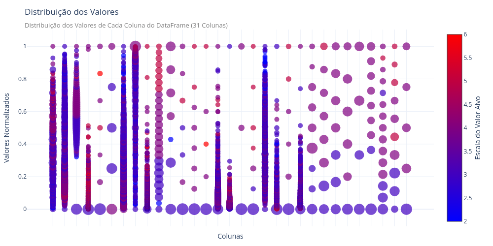

# Desenvolvimento do Gráfico Multi Scatter-plots 1D - 19/09/2024

Os dados adquiridos através do web-scrapper possuem vários atributos distintos que possuem influências distintas no valor do Nível de Desenvolvimento Econômico das cidades. 

Para analisar a relação de cada um desses atributos entre si, e com o nível econômico, implementei um gráfico que chamei de `Multi Scatter-plots 1-D`. 

Esse gráfico consiste em scatterplots unidimensionais para cada um dos atributos no eixo-X, e os valores normalizados (entre 0 e 1) para cada atributo no eixo-Y. A cor de cada um dos pontos é dada pelo valor do nível de desenvolvimento econômico da amostra que gerou o ponto. E o tamanho de cada um dos pontos é dado pelo número de amostras que possui exatamente esse valor.

  

Para melhorar a visualização das relações entre os atributos das tabelas e o valor alvo (Nível Econômico), foi necessário melhorar o método de escolha de cores para cada um dos pontos mostrados no gráfico.

Na primeira versão do gráfico, caso várias amostras possuíssem o mesmo valor em um atributo, a cor final do ponto seria a cor correspondente ao Nível econômico da última amostra adicionada. Isso é um problema pois, caso 9 de 10 amostras possuam um valor de nível econômico 2, mas a última amostra possua um valor de nível econômico 6, a cor final do ponto será correspondente à cor do nível econômico 6.

Para lidar com esse problema, na versão final do gráfico, utilizamos dois casos:
1. Caso o valor alvo seja discreto: A cor final dos pontos é dada pelo valor alvo mais frequente dentre as amostras contidas no ponto;
2. Caso o valor alvo seja contínuo: A cor final dos pontos é dada pela mediana dos valores alvos das amostras contidas no ponto.

Dessa forma o gráfico apresenta relações menos ruidosas e mais relevantes para a análise do problema.

### Próximos Passos
- Adicionar botões interativos para selecionar valores de cada classe do valor alvo
- Colocar parâmetro para controlar range de valores do valor alvo para mostrar no plot (Ex: Mostrar apenas amostras com valor alvo entre 2 e 3)

- Agrupar colunas usando meta-features:
	- Número de valores únicos na coluna
	- Tamanho médio dos pontos
	- Valor-alvo do maior e do menor valor da coluna