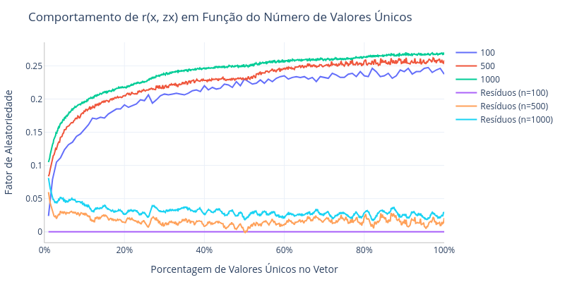
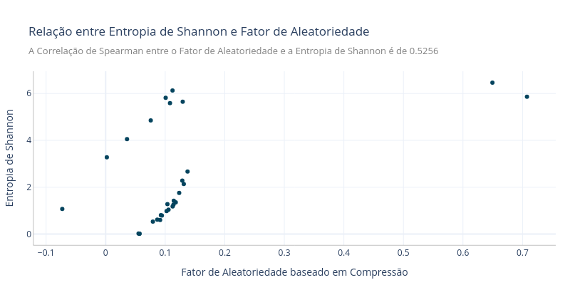

# Identificação de Atributos Aleatórios - 10/10/2024

~~Link do Notebook: https://colab.research.google.com/drive/1QeBlkdlOIzDkJxfCXIBSeTSCzo20I7qP

### Fator de Compressão

Para identificar atributos com dados aleatórios, podemos utilizar o fator de compressão de um compactador. Quanto mais fácil é compactar uma série de dados, mais padronizados eles são.

O fator de compressão pode ser afetado pelo viés do algoritmo compressor. Para diminuir a interferência do viés dos compressores na análise, utilizamos a média do fator de compressão de vários algoritmos compressores diferentes.

Existem algumas métricas que usam esse conceito para calcular a similaridade entre dois objetos como a [Normalized Compression Distance](https://medium.com/@kanvaly/normalized-compression-distance-d8698bc650b4). No entanto, essa métrica exige um vetor de referência para comparação, logo não pode ser usado para mensurar a ausência ou presença de padrões nos dados.

Para calcular o fator de compressão $c$ de um objeto, sendo $x$ o número de bytes do objeto original e $Z(x)$ o número de bytes do objeto compactado com bibliotecas como `gzip`, `bzip2`, `PPMZ`, podemos utilizar:
$$
c = \frac{Z(x)}{x}
$$

A partir disso, podemos calcular o fator de aleatoriedade $r$ de um objeto utilizando o inverso da variação de tamanho pós-compactação dividida pelo tamanho original do objeto:
$$
r(x, Z(x)) = 1 - \frac{x - Z(x)}{x}
$$
#### Propriedades do Fator de Aleatoriedade $r(x, Z(x))$

- Quanto menor o valor do fator de aleatoriedade, mais padrões existem nos dados, e quanto maior o valor do fator, mais aleatórios são os dados.

- Caso $Z(x)$ assumir o tamanho mínimo de 1 byte, a função $r$ assume seu menor valor, dado por: $$r(x, 1) = 1 - \frac{x - 1}{x} = 1 - (\frac{x}{x} - \frac{1}{x}) = 1 - 1 + \frac{1}{x} = \frac{1}{x}$$
- Caso $Z(x)$ assumir o tamanho máximo de $x$ bytes (assumindo que o arquivo compactado nunca será maior que o original), a função $r$ assume seu maior valor, dado por: $$r(x, x) = 1 - \frac{x - x}{x} = 1$$
- Para comparar o fator de aleatoriedade entre dois objetos, sem que o valor de $x$ tenha influência no resultado, é necessário que ambos possuam o mesmo valor de $x$.

- Podemos comparar dois objetos de tamanhos diferentes utilizando um método de reamostragem ou interpolação para aumentar o tamanho do menor objeto $x_1$ para o mesmo tamanho do maior objeto $x_2$. 
	- No entanto, fazer isso aumentará significativamente os padrões nos dados, criando uma impressão irreal sobre a aleatoriedade da amostra.

#### Taxa de Valores Únicos

A porcentagem de valores únicos no vetor de entrada possui influência sob o valor final do fator de aleatoriedade. Isso causa problemas ao compararmos variáveis que possuem quantidades de valores únicos diferentes.

Para remover esse viés da análise, ajustei uma função ao comportamento de $r(x, Z(x))$ em função do número de valores únicos em $x$, e defini os resíduos como: $r(x, Z(x)) - f(u)$, sendo $u$ a proporção de valores únicos no vetor de entrada.

  

### Entropia de Shannon

Para calcular a Entropia de Shannon de um atributo, calculamos um histograma com 10 bins e definimos a entropia em função da contagem de valores em cada bin $x_i$:
$$ H(X) = -\sum_{i=0}^{N} x_i \log_2(x_i) $$

  

