# Filtragem de Atributos Mal Comportados - 07/11/2024

## Atributos Bem Comportados

Para separarmos os atributos em duas categorias (`Bem Comportados` e `Mal Comportados`) utilizamos um espaço gerado pela Entropia de Shannon e pelo Fator de Aleatoriedade. 

Assim, definimos uma região (`Zona Bem Comportada`) onde ambas as métricas indicavam que o atributo era pouco aleatório ou rico em padrões. Todos os atributos dentro dessa região foram classificados como `Bem Comportados` e todos os outros como `Mal Comportados`.

### Dimensão Econômica

  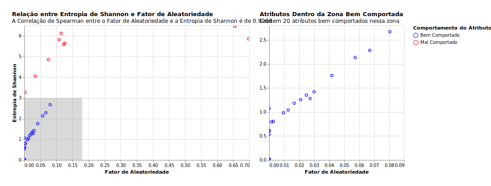

### Dimensão Capacidades Institucionais

  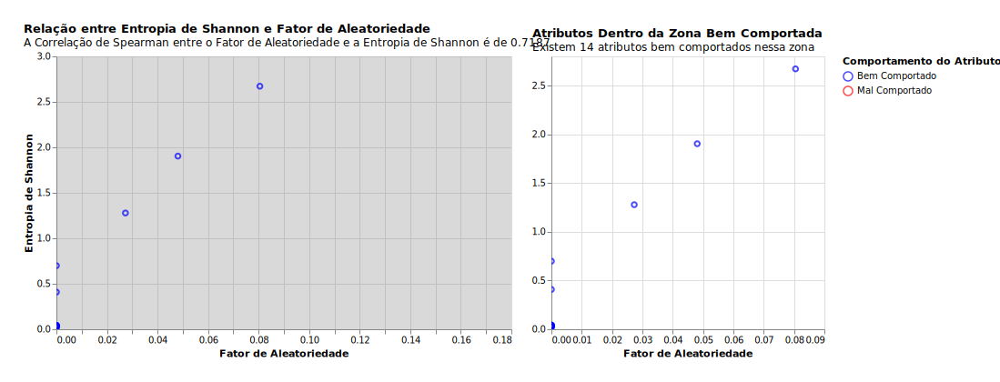

### Dimensão Meio Ambiente

  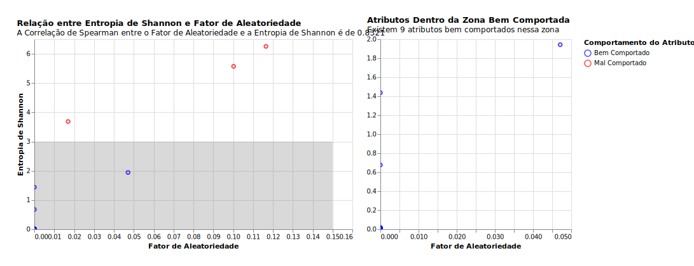

### Dimensão Sociocultural

  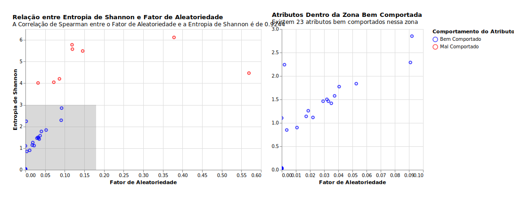

## Atributos Correlacionados

Para lidar com atributos redundantes, uma análise sob a correlação dos atributos foi realizada. Para cada atributo disponível procuramos, nas correlações com outros atributos, alguma correlação maior do que `0.7`

Então, para cada par altamente correlacionado, procuramos o atributo com o menor `Score de Aleatoriedade`, definido pela média entre a `Entropia de Shannon` e  o `Fator de Aleatoriedade`. O atributo escolhido é mantido na análise e o outro é descartado.

### Dimensão Econômica

  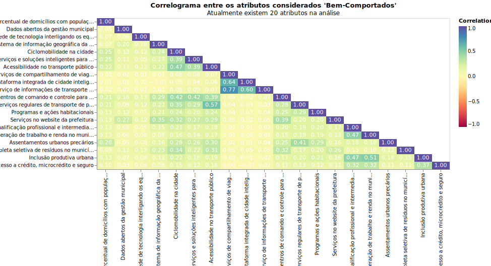

  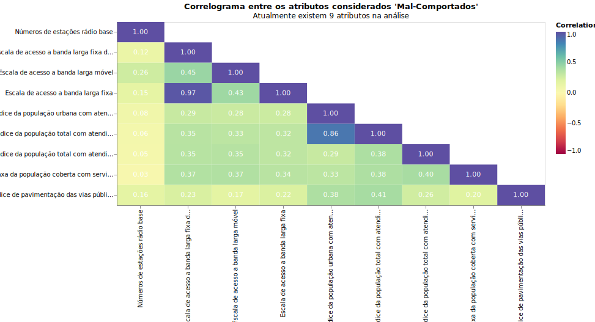

### Dimensão Capacidades Institucionais

  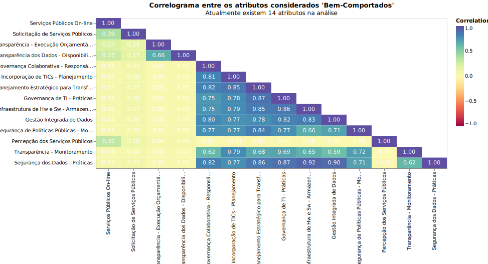

### Dimensão Meio Ambiente

  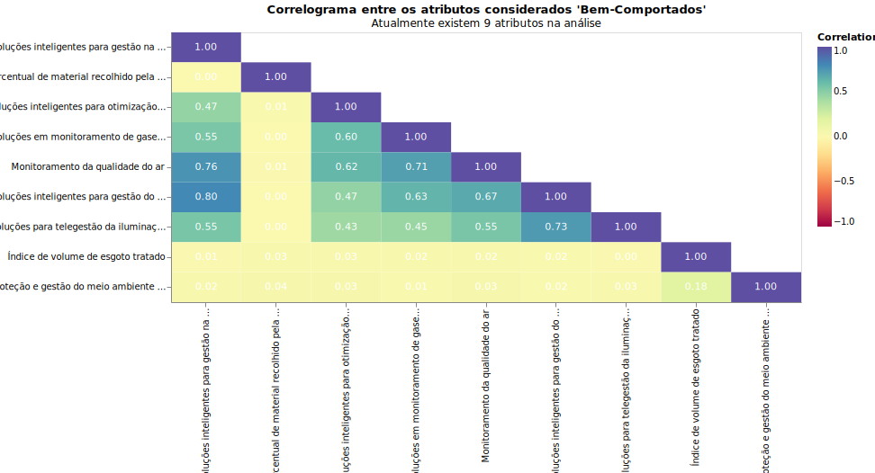

  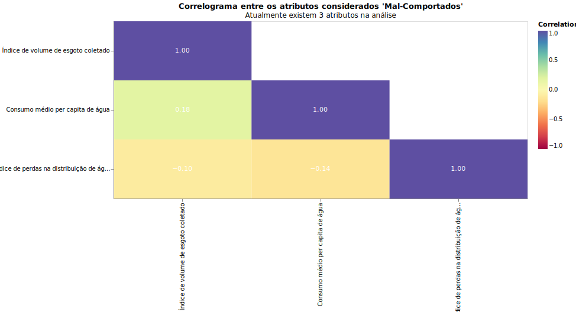

### Dimensão Sociocultura

  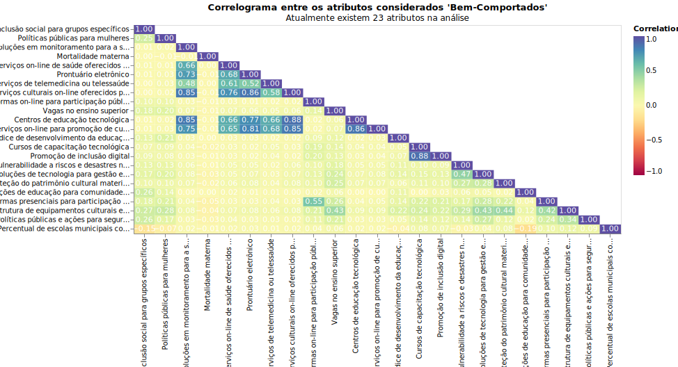

  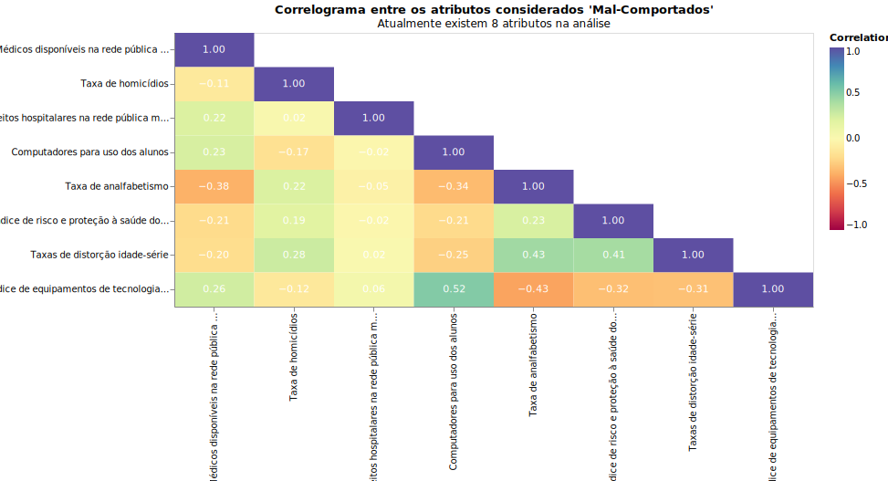

