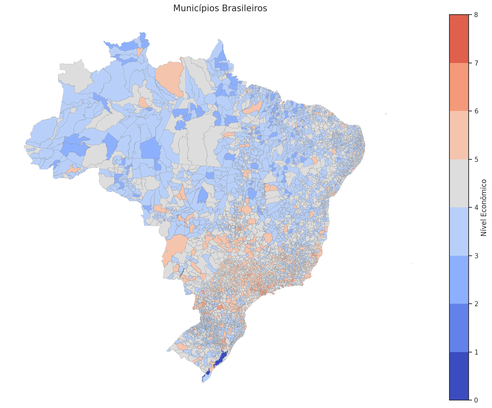
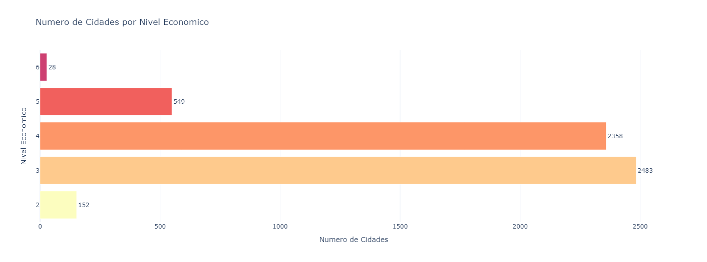
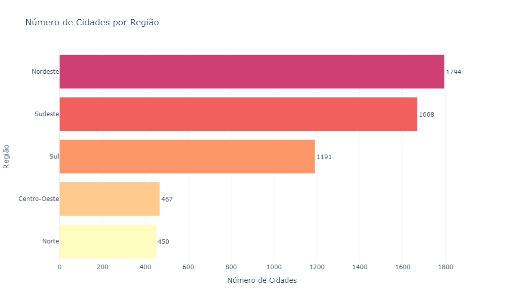
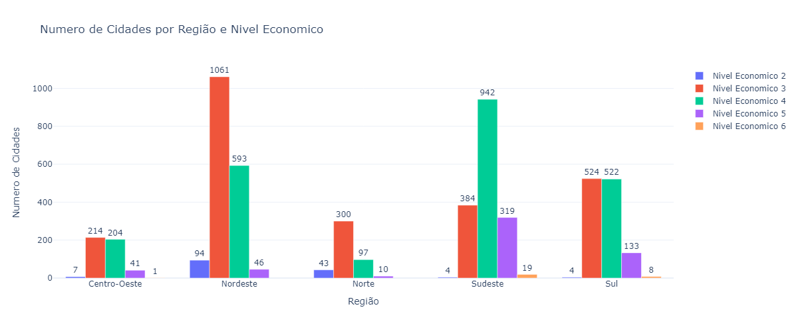
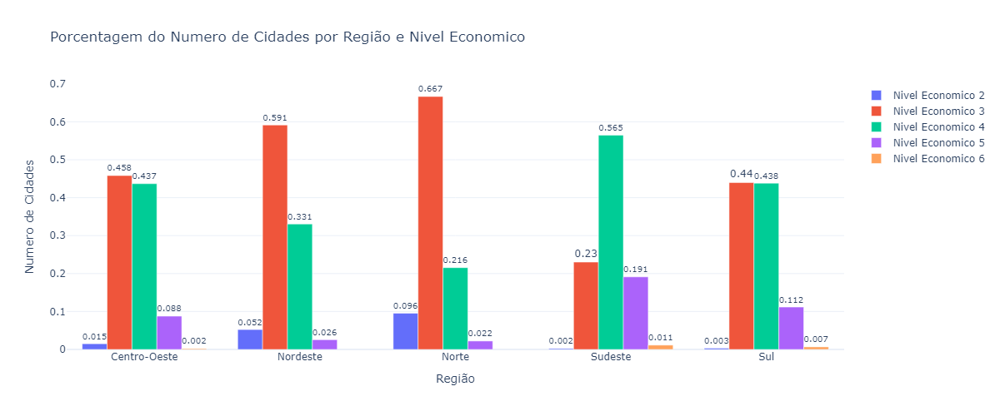
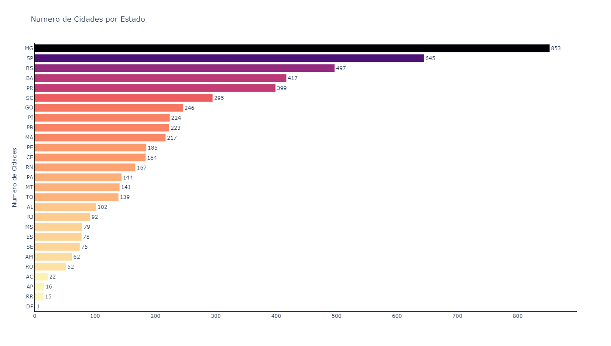
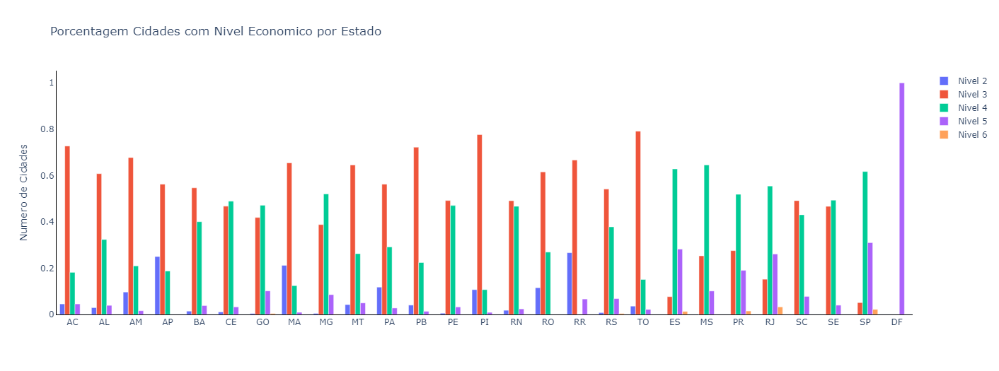

# Análise do Comportamento do Nível Econômico sob uma Perspectiva Geográfica

Neste estudo, é importante destacar que buscamos compreender como o nível econômico se distribui e se comporta geograficamente no Brasil. A análise tem como objetivo identificar padrões e agrupar regiões em que municípios apresentem comportamentos econômicos semelhantes. Ao aplicar essa abordagem, é possível visualizar concentrações de municípios com níveis econômicos próximos, oferecendo uma visão mais clara das disparidades regionais e das semelhanças econômicas dentro do território brasileiro.

- Os dados apresentados abaixo estarão disponíveis no notebook, dentro do mesmo diretório: .

## Visualização a nível de Município
Com o objetivo de compreender a distribuição dos níveis econômicos em todo o território brasileiro, foi plotado um mapa que exibe todos os municípios coloridos de acordo com seus respectivos níveis econômicos. De maneira geral, é perceptível uma grande heterogeneidade no comportamento econômico entre os municípios. No entanto, uma informação valiosa que emerge é a concentração dos maiores níveis econômicos nas regiões Sul e Sudeste do país, enquanto os menores níveis se concentram predominantemente na região Norte.

  

Contudo, é difícil ter uma noção clara da distribuição dos municípios de acordo com seus níveis econômicos ou mesmo identificar a predominância de determinado nível econômico em todo o país. No entanto, ao criarmos um gráfico de barras, conseguimos visualizar com mais precisão quais níveis econômicos são mais predominantes. 

  

Observa-se que, embora a escala de níveis econômicos varie entre 1 e 7, não há municípios situados nas extremidades desse intervalo. Pelo contrário, há uma alta concentração de municípios nos níveis 3 e 4, enquanto pouquíssimas cidades apresentam nível econômico 6, somando apenas 28 municípios com essa característica.

## Visualização a nível de Região

  

  Fonte: Brasil Escola. Disponível em: <a href="https://brasilescola.uol.com.br">https://brasilescola.uol.com.br/brasil/regioes-brasileiras.htm</a>

Ao avaliarmos o nível econômico por região, é interessante, inicialmente, entender o número de municípios que cada uma das regiões brasileiras – Norte, Nordeste, Sul, Sudeste e Centro-Oeste – possui. Descobrimos que o Nordeste está em primeiro lugar em termos de número de municípios, seguido pelas regiões Sudeste, Sul, Centro-Oeste e, por último, Norte. 

  

No entanto, essa informação, por si só, não revela muito sobre o comportamento econômico das regiões. Por isso, é necessário analisar também o número de cidades por nível econômico em cada região, para extrair informações mais significativas. Por exemplo, podemos investigar se o número de cidades em uma região está relacionado a um nível econômico menor ou maior.

  

Dessa forma, ao visualizarmos o gráfico acima, notamos que as duas regiões com o maior número de municípios – Nordeste e Sudeste – apresentam distribuições diferentes em relação ao número de municípios por nível econômico. O Nordeste apresenta uma maior concentração no nível econômico 3, seguido pelo nível 4. Em contrapartida, o Sudeste demonstra uma concentração maior no nível econômico 4 e um certo equilíbrio entre os níveis 3 e 5. 

Para avaliar a existência de distribuições semelhantes, analisar apenas o número absoluto de cidades poderia nos dar uma falsa impressão, devido às diferenças na quantidade de municípios por região. Assim, para entender melhor o comportamento econômico das regiões, foi feita uma análise percentual do número de cidades de cada nível econômico por região.

  

Com isso, confirmamos novamente o comportamento distinto entre as duas regiões com maior número de municípios, que apresentam diferentes proporções de cidades em cada nível econômico. No entanto, há uma semelhança entre as regiões Centro-Oeste e Sul. Para compreender melhor as razões por trás desse comportamento, seria necessário investigar fatores econômicos, populacionais, entre outros. Contudo, como esse não é o foco central desta análise, o tema será abordado em outro capítulo.

## Visualização a nível de Estado

Para isso, repetiremos os mesmos passos mencionados anteriormente. Primeiro, visualizaremos o número de cidades em cada estado brasileiro e, em seguida, verificaremos as distribuições dos níveis econômicos dos municípios em cada estado, com o objetivo de identificar a existência de comportamentos semelhantes.

  

A princípio, visualizamos que o número de municípios por estado apresenta um comportamento bastante heterogêneo. Ou seja, cada estado tem quantidades variadas de municípios, embora alguns apresentem valores próximos. No entanto, os estados com o maior número de municípios estão concentrados em Minas Gerais, São Paulo e Rio Grande do Sul.

  

Verificando as distribuições dos municípios e seus respectivos níveis econômicos, percebemos novamente o comportamento heterogêneo entre estados próximos, como Minas Gerais e São Paulo. Embora ambos pertençam à mesma região, o Sudeste, apresentam distribuições bem distintas: São Paulo concentra mais municípios nos níveis 4 e 5, enquanto Minas Gerais se destaca nos níveis 3 e 4. Contudo, o oposto também ocorre, com estados próximos que apresentam distribuições econômicas semelhantes entre seus municípios, como é o caso de Rio Grande do Norte e Pernambuco.

