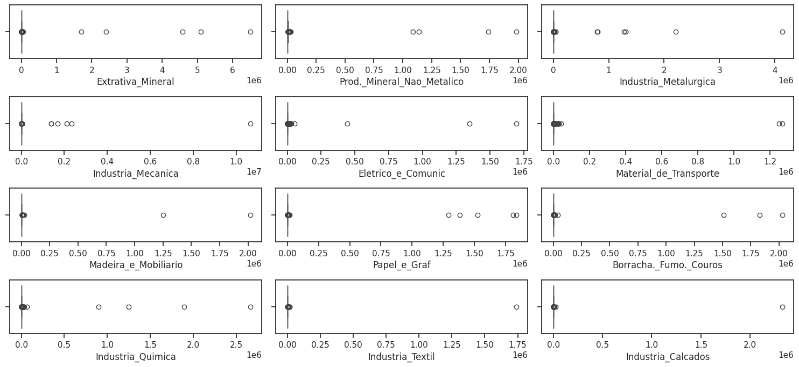
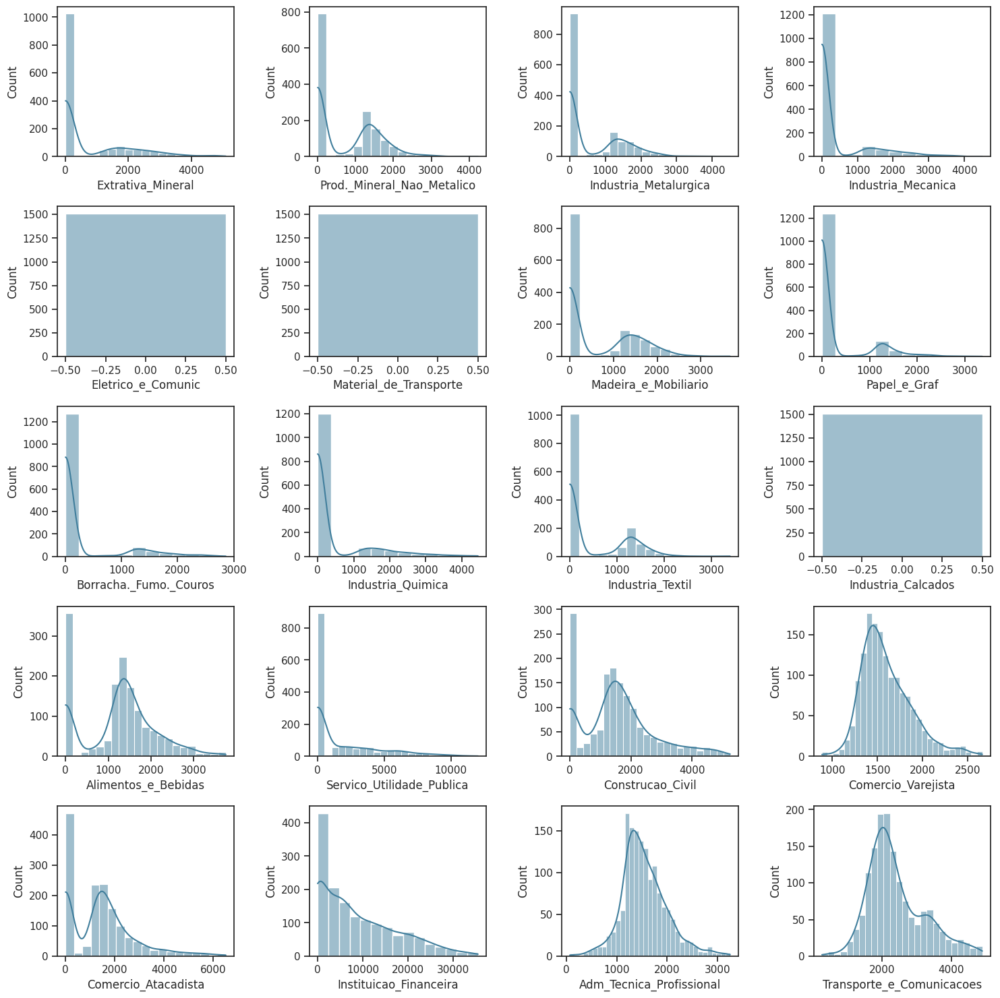
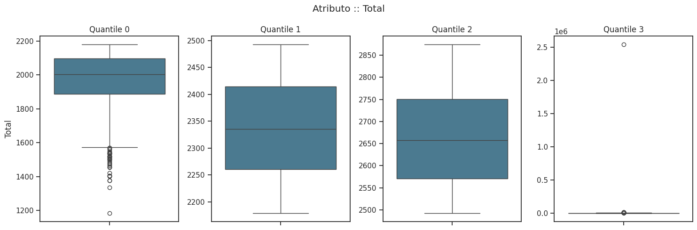
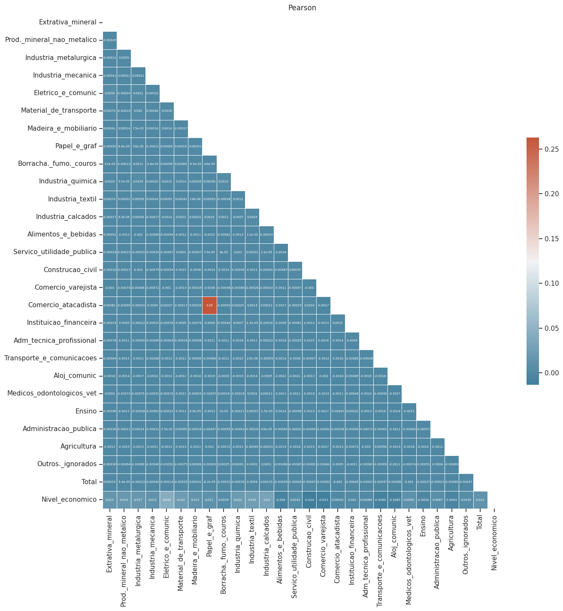
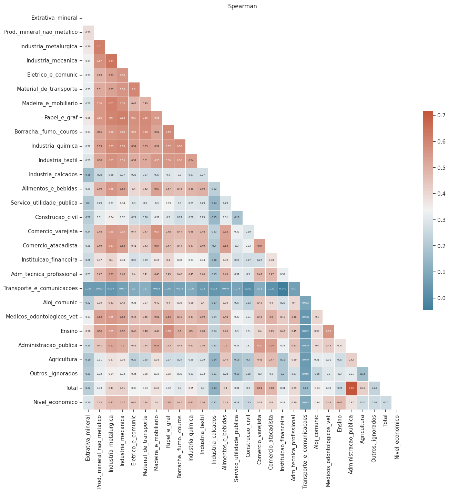
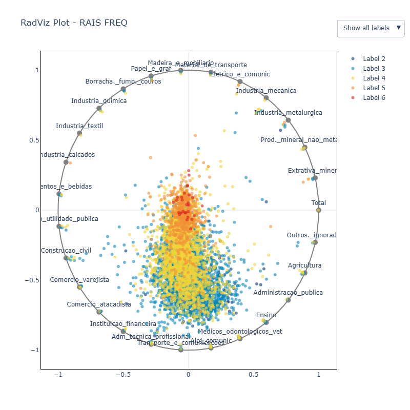
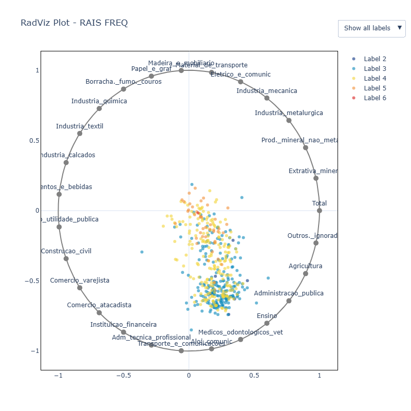
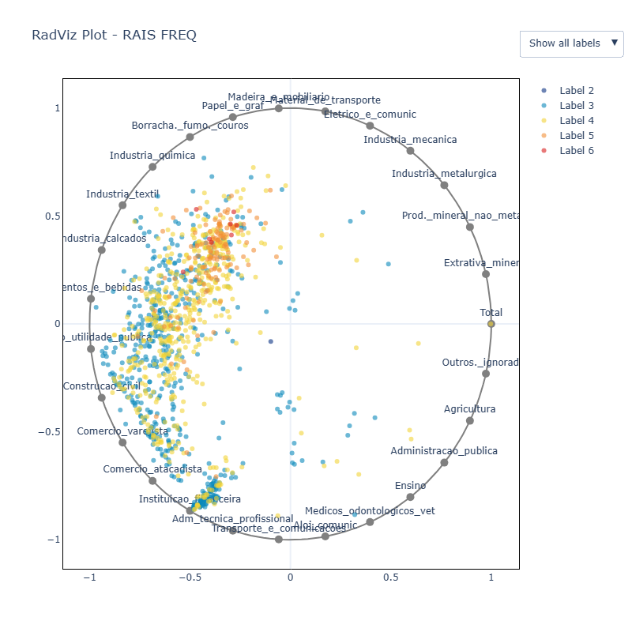
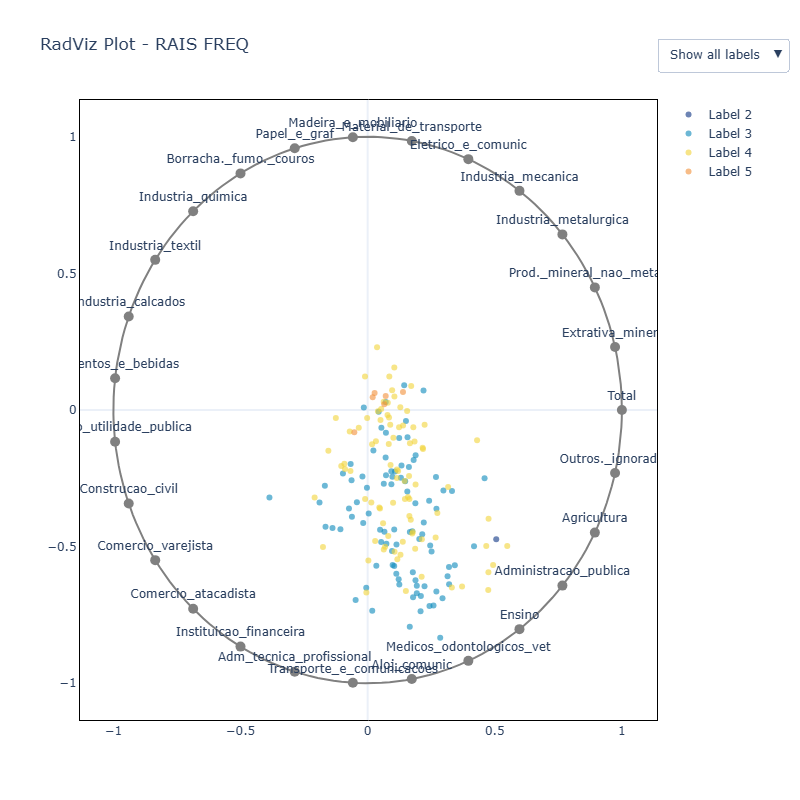
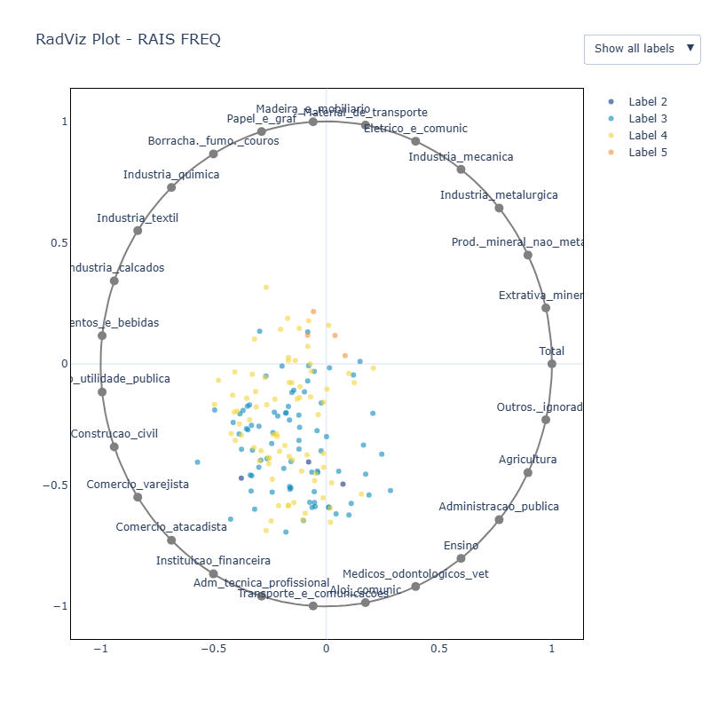

# Análise do Conjunto de Dados
A análise exploratória foi realizada para compreender melhor o conjunto de dados, focando na distribuição das variáveis, identificação de outliers e outros padrões relevantes.

## Variáveis do Conjunto de Dados

Este dataset contém informações de diversos setores econômicos por município, e suas respectivas remunerações médias, com 5.570 entradas e 28 colunas.

| **Coluna**                     | **Drendarição**                                                                 |
|--------------------------------|-------------------------------------------------------------------------------|
| `NO_MUNICIPIO`                 | Nome do município.                                                           |
| `Extrativa Mineral`            | Dados relacionados à indústria de extração mineral.                          |
| `Prod. Mineral Não Metálico`   | Produção de minerais não metálicos.                                           |
| `Indústria Metalúrgica`        | Indústria metalúrgica.                                                       |
| `Indústria Mecânica`           | Indústria mecânica.                                                          |
| `Elétrico e Comunic`           | Indústrias elétricas e de comunicação.                                        |
| `Material de Transporte`       | Produção de materiais relacionados ao transporte.                            |
| `Madeira e Mobiliário`         | Indústria de madeira e fabricação de móveis.                                 |
| `Papel e Gráf`                 | Indústria de papel e gráfica.                                                |
| `Borracha. Fumo. Couros`       | Produção de borracha, fumo e couro.                                           |
| `Indústria Química`            | Indústria química.                                                           |
| `Indústria Têxtil`             | Indústria têxtil.                                                            |
| `Indústria Calçados`           | Indústria de calçados.                                                       |
| `Alimentos e Bebidas`          | Produção de alimentos e bebidas.                                             |
| `Serviço Utilidade Pública`    | Serviços de utilidade pública.                                               |
| `Construção Civil`             | Dados relacionados à construção civil.                                       |
| `Comércio Varejista`           | Comércio varejista.                                                          |
| `Comércio Atacadista`          | Comércio atacadista.                                                         |
| `Instituição Financeira`       | Instituições financeiras.                                                    |
| `Adm Técnica Profissional`     | Administração técnica e profissional.                                         |
| `Transporte e Comunicações`    | Dados do setor de transporte e comunicações.                                 |
| `Aloj Comunic`                 | Dados relacionados ao setor de alojamento e comunicação.                     |
| `Médicos Odontológicos Vet`    | Serviços médicos, odontológicos e veterinários.                              |
| `Ensino`                       | Dados do setor de educação.                                                  |
| `Administração Pública`        | Administração pública.                                                       |
| `Agricultura`                  | Dados relacionados à agricultura.                                            |
| `Outros. ignorados`            | Outros setores ou categorias não classificadas.                              |
| `Total`                        | Total consolidado de todas as categorias para o município correspondente.    |

### Observações
- **Total de Entradas:** 5.570 municípios.
- **Tipo de Dados:** Todas as colunas, exceto `NO_MUNICIPIO`, possuem valores numéricos (`float64`).
- **Fonte:** Relação Anual de Informações Sociais (RAIS).

## Distribuição das Variáveis

Para compreender a distribuição das variáveis numéricas, foi gerado um **gráfico de Violino**:

  

### Observações sobre o BoxPlot:
- O gráfico indica um grande número de **outliers**, o que dificulta a visualização da distribuição das variáveis.

## Outliers

Destacam-se as seguintes cidades com valores identificados como outliers pelo **BoxPlot**:

| **ID**   | **Município**              | **Estado** | **Total**         |
|----------|----------------------------|------------|-------------------|
| 4023     | Jardim Olinda              | PR         | 2.537.721,00      |
| 4486     | São Francisco do Sul       | SC         | 14.494,82         |
| 4518     | Treze Tílias               | SC         | 13.018,40         |
| 3865     | Antonina                   | PR         | 11.945,33         |
| 3998     | Indianópolis               | PR         | 11.055,09         |
| 4629     | Carlos Barbosa             | RS         | 10.372,96         |
| 4578     | Barra Funda                | RS         | 9.467,67          |
| 5478     | Turvelândia                | GO         | 9.246,38          |
| 4980     | Tenente Portela            | RS         | 9.220,27          |
| 600      | Santo Antônio dos Lopes    | MA         | 9.199,22          |
| 4742     | Imigrante                  | RS         | 8.596,69          |
| 4099     | Paraíso do Norte           | PR         | 8.330,08          |
| 1746     | Japaratuba                 | SE         | 8.187,44          |
| 1894     | Conceição do Jacuípe       | BA         | 7.960,42          |
| 4101     | Paranaguá                  | PR         | 7.906,95          |
| 2144     | São Francisco do Conde     | BA         | 7.856,58          |
| 4196     | São Manoel do Paraná       | PR         | 7.727,23          |
| 4881     | Riozinho                   | RS         | 7.599,06          |
| 3482     | Itirapina                  | SP         | 7.403,09          |
| 4355     | Imbituba                   | SC         | 7.216,84          |

#### Considerações:
Os valores apresentados refletem dados econômicos consolidados por município, destacando as maiores médias salariais considerando a soma de todos os setores industriais. Entre os 100 maiores valores, observa-se uma predominância dos estados de São Paulo (17), Rio Grande do Sul (17), Minas Gerais (14), Santa Catarina (11) e Paraná (11). Embora sejam classificados como outliers, esses valores representam um padrão natural, possivelmente associado ao nível de desenvolvimento econômico dos estados analisados.

Essa análise inicial destaca a necessidade de ajustes nos métodos de visualização e, possivelmente, o agrupamento dos dados para uma avaliação mais clara da distribuição das variáveis. Observa-se que, ao removermos os valores considerados outliers pelo **BoxPlot**, os dados restantes apresentariam distribuições diversas. 

  

Contudo, essa abordagem resultaria em um conjunto de dados comaproximadamente 1500 municípios, limitando a análise às localidades com distribuições mais homogêneas. Essa restrição poderia comprometer tanto a representatividade quanto a abrangência do estudo, uma vez que o Brasil, devido à sua extensa dimensão geográfica, apresenta uma grande diversidade entre os municípios.

### Agrupamento por Quantil
No entanto, agrupar os dados também não é uma tarefa trivial, pois como dito a região brasileira possui características distintas e únicas. Se optarmos por agrupar os dados com base na coluna Total (que representa a soma de todos os atributos), notamos que, mesmo dentro do grupo de "outliers", há valores extremamente discrepantes. 

  

## Correlações
Ao adicionar ao conjunto de dados a variável target "nível econômico", buscamos identificar variáveis que apresentassem relações significativas com a variável resposta. Para isso, foram utilizadas as correlações de Pearson e Spearman.

  <figure> 
     
  </figure> 
  <figure> 
    

#### Resultados Observados:
1. **Correlação Linear (Pearson):** As variáveis não apresentam uma relação linear direta forte com a variável target "nível econômico".
2. **Correlação Monotônica (Spearman):** Identificou-se uma relação monotônica moderada entre algumas variáveis e o nível econômico, sugerindo que à medida que uma variável aumenta, há uma tendência consistente (mas não linear) de aumento ou diminuição no nível econômico, o que nos indica que explorar outras formas de relação entreas variaveis e um caminho interssante.

## Análise de Variáveis
A fim de compreender melhor como as variaveis se relacionam com o nível economicom e feito uma analise usando uma métrica de **MutualInformation** em conjunto de uma vizualização multivariada **RadViz**.

### País

  

Ao avaliarmos o gráfico RadViz, observamos que, dependendo do nível econômico, as forças de atração entre as variáveis podem mudar significativamente, como por exemplo:

1. Nos níveis econômicos 2, 3 e 4, observa-se uma maior força de atração entre as variáveis _Adm_tecnica_profissional_, _Transporte_e_comunicacao_, _Aloj_comunicacao_ e _Medicos_odontologicos_vet_, indicando uma força mais acentuada com atributos de natureza social. 

2. Em contraste, nos níveis econômicos 5 e 6, os dados apresentam uma distribuição mais centralizada, evidenciando uma interação de forças mais equilibrada entre as variáveis.

3. Por fim, destaca-se a relação evidente de municípios que demonstram dependência em uma única variável, indicando um foco concentrado na produção industrial de apenas um segmento específico.

Esses insights indicam que a relação entre as variáveis e o nível econômico não é uniforme, e pode variar conforme o nível analisado, destacando a importância de uma análise segmentada para capturar as nuances dessa interação.

| **Setor**               | **Mutual Information** |
|--------------------------|-------------------------|
| Indústria Mecânica       | 0.152115               |
| Indústria Metalúrgica    | 0.150286               |
| Ensino                   | 0.149862               |
| Material de Transporte   | 0.149193               |
| Papel e Gráfica          | 0.142883               |

Contudo, ao considerarmos a informação mútua entre as variáveis observadas e a variável target (nível econômico), chegamos a resultados distintos. A tabela anterior mostra as variáveis com maior informação mútua em relação à variável resposta. Esses resultados indicam que as variáveis que apresentam uma forte associação com o nível econômico não são necessariamente as mesmas quando avaliamos todas as variáveis em conjunto.

### Região
É válido ressaltar que, dentro das mesmas regiões, o comportamento observado na análise multivariada não necessariamente segue o mesmo padrão da análise univariada. No entanto, é interessante notar que, entre diferentes regiões, o comportamento das análises muda de forma muito significativa. Ou seja, a interação entre as variáveis e a variável de interesse (nível econômico) pode variar substancialmente quando comparamos uma região a outra. Esse comportamento regionalizado reforça a complexidade dos dados e destaca a importância de considerar as características e particularidades regionais ao realizar qualquer tipo de análise.

1. Centro-Oeste

| **Setor**                        | **Mutual Information** |
|-----------------------------------|-------------------------|
| Instituição Financeira           | 0.139335               |
| Administração Pública            | 0.122155               |
| Material de Transporte           | 0.120879               |
| Ensino                           | 0.120518               |
| Produção Mineral Não Metálico    | 0.120146               |

2. Sul

| **Setor**                        | **Mutual Information** |
|-----------------------------------|-------------------------|
| Ensino                           | 0.153576               |
| Material de Transporte           | 0.133967               |
| Produção Mineral Não Metálico    | 0.122772               |
| Papel e Gráfica                  | 0.113165               |
| Borracha, Fumo e Couros          | 0.106680               |

  <figure> 
     
  </figure> 
  <figure> 
    

### Estado
Ademais, ao variar o nível de granularidade, observamos novamente que os atributos mais relevantes e o comportamento das interações entre variáveis, conforme ilustrado pelo gráfico RadViz, sofrem alterações. Isso reforça a necessidade de adaptar a análise de dados ao contexto e à granularidade da região em estudo. 

1. Pernambuco

| **Setor**                        | **Mutual Information** |
|-----------------------------------|-------------------------|
| Ensino                           | 0.111056               |
| Elétrico e Comunicação           | 0.103835               |
| Médicos, Odontológicos e Veterinários | 0.095630          |
| Borracha, Fumo e Couros          | 0.093769               |
| Papel e Gráfica                  | 0.091429               |

2. Rio Grande do Norte

| **Setor**                        | **Mutual Information** |
|-----------------------------------|-------------------------|
| Borracha, Fumo e Couros          | 0.132849               |
| Material de Transporte           | 0.111452               |
| Indústria Metalúrgica            | 0.095969               |
| Indústria Têxtil                 | 0.089044               |
| Madeira e Mobiliário             | 0.084866               |

  <figure> 
     
  </figure> 
  <figure> 
    

Estas observalções são especialmente relevante, pois ao ajustar a granularidade e a região de análise, é possível identificar padrões de nichos industriais. Nota-se que alguns estados apresentam, predominantemente, um desenvolvimento industrial segmentado, enquanto outros exibem uma diversidade maior de fontes de desenvolvimento. Esse comportamento reforça, mais uma vez, a importância de considerar o aspecto espacial nas análises, garantindo uma compreensão mais abrangente das dinâmicas econômicas regionais.

