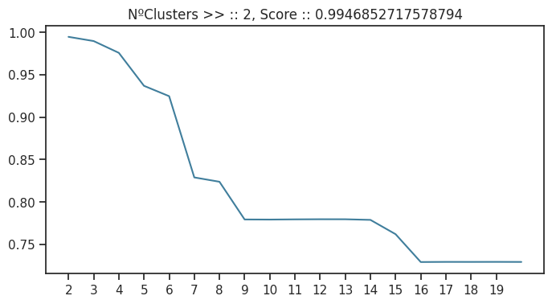
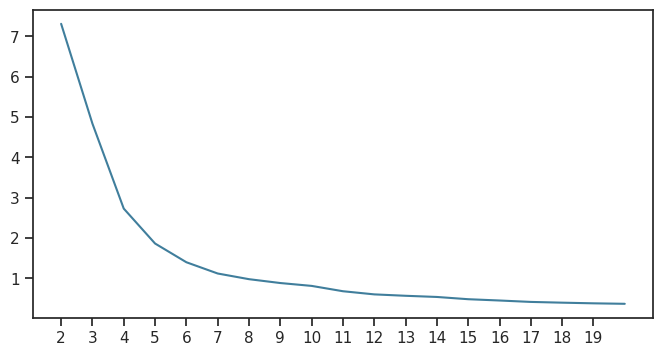
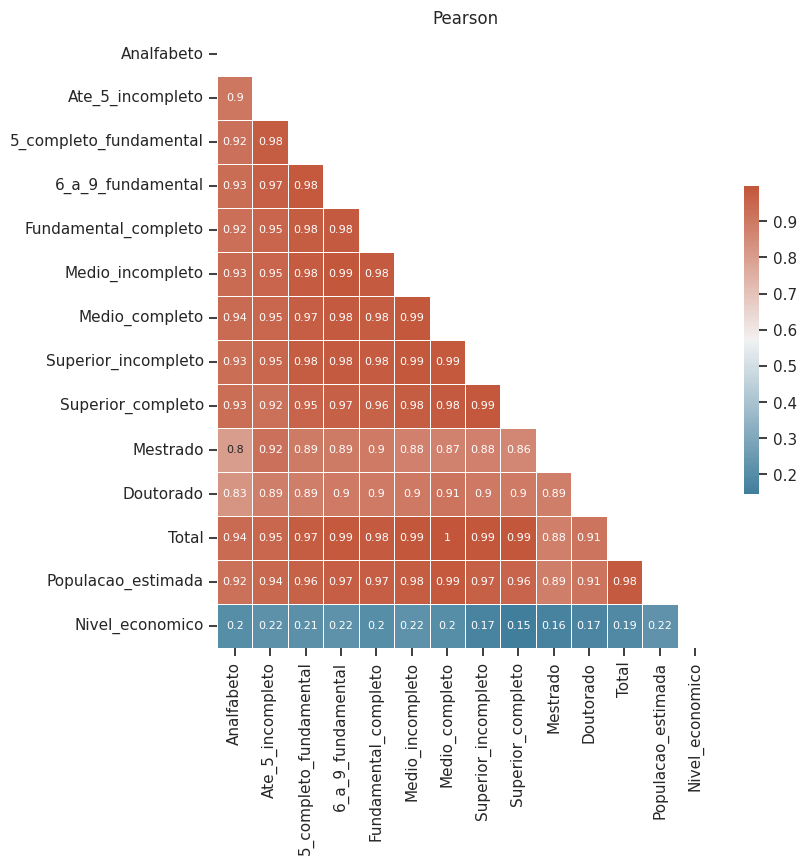
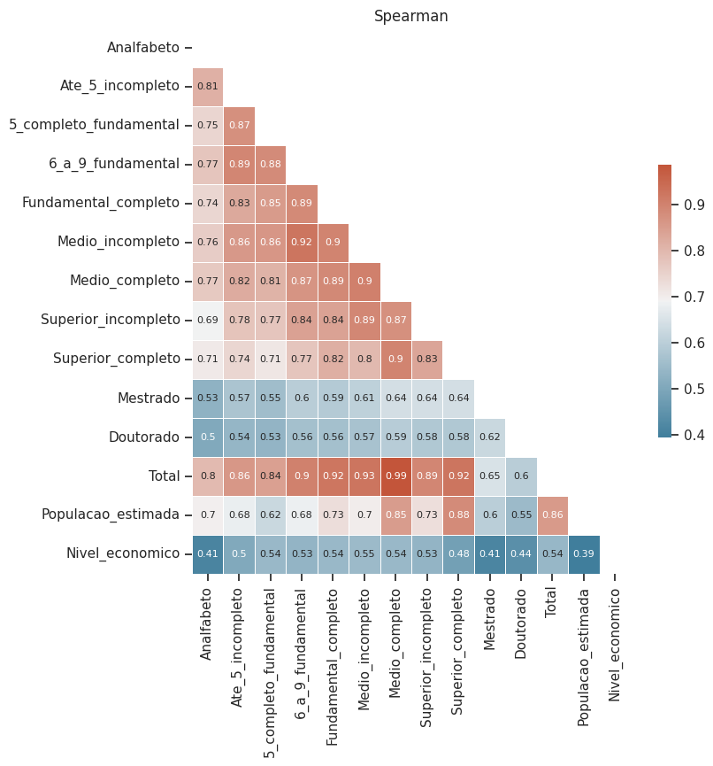
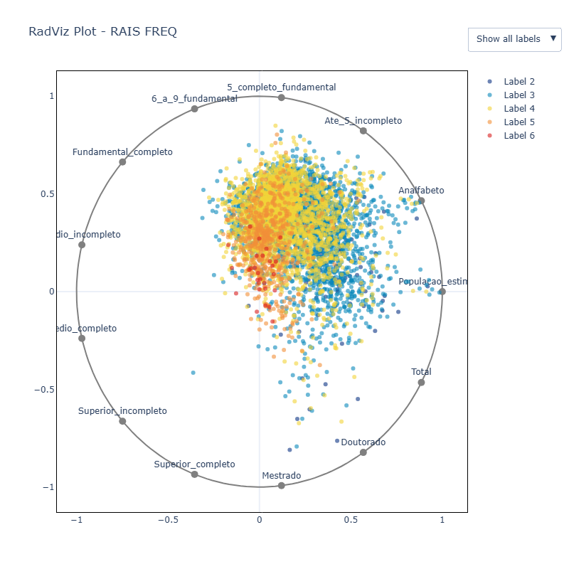
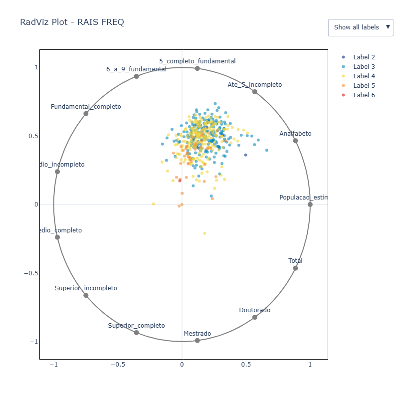
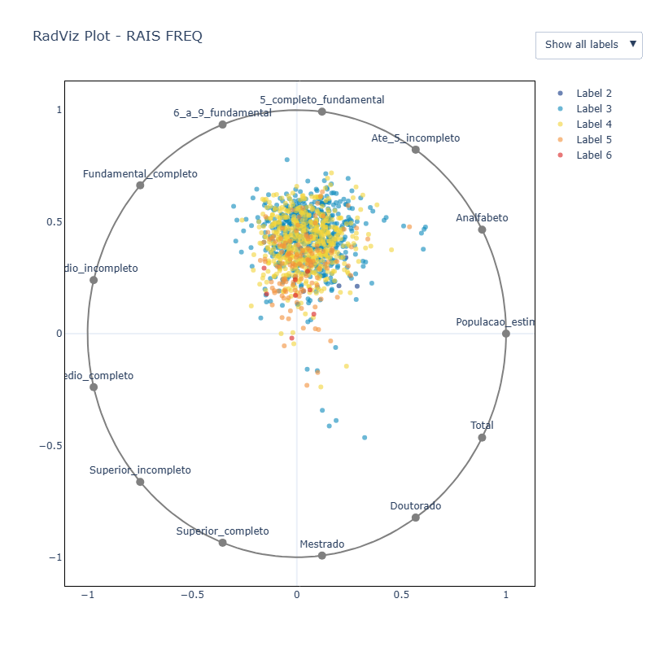
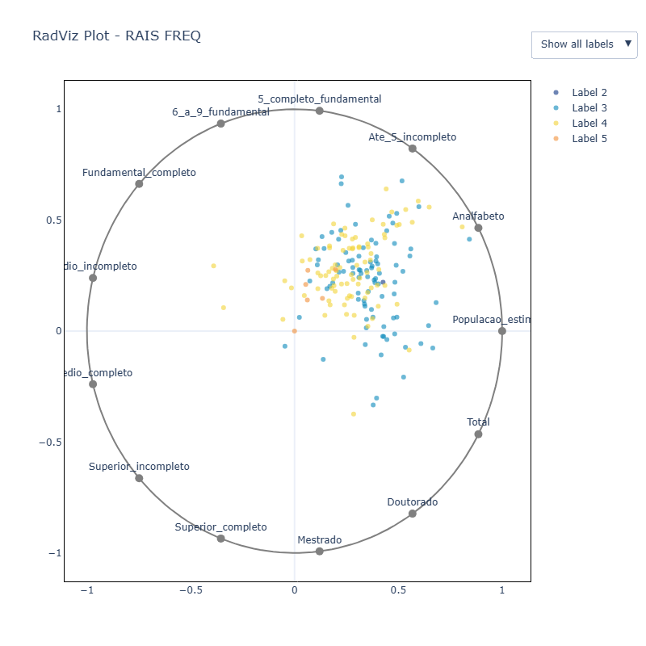
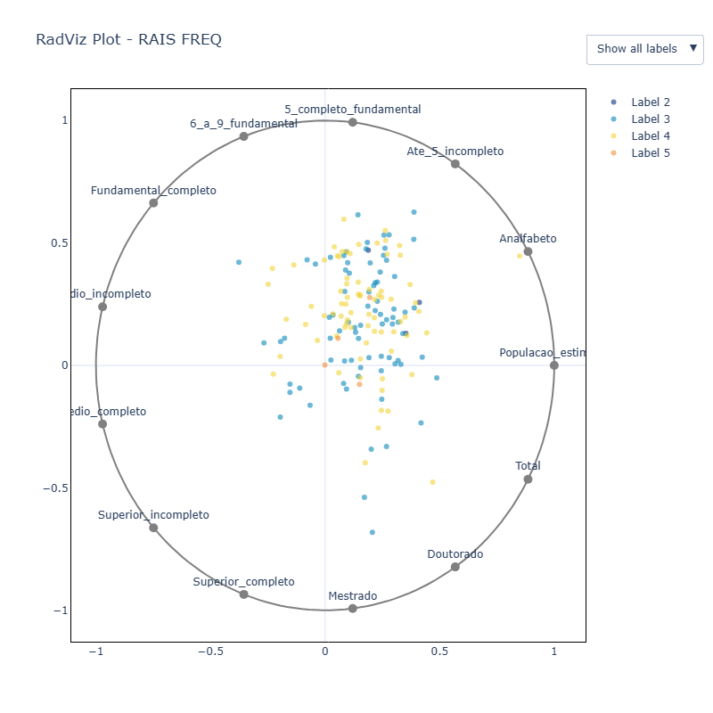

# Análise do Conjunto de Dados
A análise exploratória foi realizada para compreender melhor o conjunto de dados, focando na distribuição das variáveis, identificação de outliers e outros padrões relevantes.

## Variáveis do Conjunto de Dados

O conjunto de dados contém as seguintes variáveis, sem valores ausentes. Cada linha representa um município:

| **Variável**                 | **Descrição**                     | **Valores não nulos** | **Tipo**  |
|------------------------------|-----------------------------------|------------------------|-----------|
| Estado                      | Estado ao qual o município pertence | 5570                 | *object*  |
| Municipio                   | Nome do município                 | 5570                 | *object*  |
| Analfabeto                  | Número de pessoas analfabetas      | 5570                 | *int64*   |
| Ate_5_incompleto            | Pessoas com até 5 anos de estudo incompleto | 5570 | *int64* |
| 5_completo_fundamental      | Pessoas com 5 anos completos do fundamental | 5570 | *int64* |
| 6_a_9_fundamental           | Pessoas com 6 a 9 anos do fundamental | 5570 | *int64* |
| Fundamental_completo        | Pessoas com ensino fundamental completo | 5570 | *int64* |
| Medio_incompleto            | Pessoas com ensino médio incompleto | 5570 | *int64* |
| Medio_completo              | Pessoas com ensino médio completo | 5570 | *int64* |
| Superior_incompleto         | Pessoas com ensino superior incompleto | 5570 | *int64* |
| Superior_completo           | Pessoas com ensino superior completo | 5570 | *int64* |
| Mestrado                   | Pessoas com mestrado completo      | 5570                 | *int64*   |
| Doutorado                   | Pessoas com doutorado completo    | 5570                 | *int64*   |
| Total                       | População total do município       | 5570                 | *int64*   |

## Distribuição das Variáveis

Para compreender a distribuição das variáveis numéricas, foi gerado um **gráfico de BoxPlot**:

  

### Observações sobre o BoxPlot:
- O gráfico indica um grande número de **outliers**, o que dificulta a visualização da distribuição das variáveis.
- Esses outliers são principalmente associados a municípios com grandes populações.

## Outliers

Os valores identificados como outliers pelo BoxPlot correspondem, em sua maioria, a grandes municípios brasileiros. Destacam-se as seguintes cidades:

| **Município**         | **População Total** |
|-----------------------|----------------------|
| São Paulo             | 5.390.446           |
| Rio de Janeiro        | 2.339.294           |
| Belo Horizonte        | 1.287.288           |
| Brasília              | 1.250.053           |
| Curitiba              | 935.984             |
| Fortaleza             | 828.827             |
| Salvador              | 788.195             |
| Recife                | 703.180             |
| Porto Alegre          | 684.076             |
| Goiânia               | 643.009             |
| Manaus                | 582.757             |
| Belém                 | 433.899             |
| Campinas              | 433.812             |
| São Luís              | 394.063             |
| Guarulhos             | 376.358             |
| Barueri               | 367.439             |
| Florianópolis         | 311.473             |
| Campo Grande          | 307.059             |
| Natal                 | 307.027             |
| João Pessoa           | 301.635             |

#### Considerações:
- Esses valores elevados refletem a concentração populacional em capitais e grandes centros urbanos.
- Embora sejam classificados como outliers, representam um padrão natural devido às características populacionais do Brasil.

Essa análise inicial destaca a necessidade de ajustes nos métodos de visualização e, possivelmente, o agrupamento dos dados para uma avaliação mais clara da distribuição das variáveis. Observa-se que, ao removermos os valores considerados outliers pelo **BoxPlot**, os dados restantes apresentariam distribuições próximas a uma **distribuição Gamma**. 

  

Contudo, essa abordagem resultaria na exclusão de muitos municípios, restringindo a análise apenas às localidades com distribuições mais homogêneas. Isso poderia comprometer a representatividade e a abrangência da análise, já que os municípios mais populosos, que frequentemente influenciam a dinâmica econômica e social, seriam desconsiderados.

### Agrupamento por Quantil
No entanto, agrupar os dados também não é uma tarefa trivial, pois cada região brasileira possui características distintas e únicas. Se optarmos por agrupar os dados com base na coluna Total (que representa a soma de todos os atributos), notamos que, mesmo dentro do grupo de "outliers", há valores extremamente discrepantes. Por exemplo, municípios como São Paulo e Belo Horizonte apresentam valores muito acentuados, como ilustrado na tabela anterior.

  

### Agrupamento por Kmeans
O comportamento observado reforça que, mesmo ao segmentar os dados com base em um critério como o total populacional, grandes disparidades dentro de cada grupo ainda precisam ser tratadas. Isso destaca a necessidade de desenvolver critérios adicionais ou abordagens mais robustas que levem em conta as diferenças regionais, sem descartar informações relevantes.

No entanto, utilizar algoritmos de clusterização, como o K-Means, sem uma análise prévia e um pré-processamento adequado, frequentemente não produz resultados satisfatórios. Por exemplo:

1. Pré-processamento com Normalização:
Após aplicar uma normalização simples, como MinMax, os valores de cada variável são escalonados para um intervalo comum (geralmente entre 0 e 1). Isso é essencial para evitar que variáveis com maior amplitude dominem o agrupamento.

2. Número de Clusters:
Ao aplicar o K-Means e utilizar a medida de Silhouette para determinar o melhor número de clusters, o resultado foi 2 clusters, indicando uma separação grosseira dos dados. Por outro lado, ao avaliar a curva do cotovelo, que mede a inércia (soma das distâncias dentro dos clusters), observamos que um valor mais adequado seria em torno de 12 clusters.

 <figure>  </figure> <figure> 

Essas discrepâncias demonstram que diferentes critérios de avaliação podem levar a conclusões distintas. A escolha do número ideal de clusters deve considerar não apenas as métricas quantitativas, mas também o contexto do problema e uma análise qualitativa e efetiva dos dados.

## Correlações
Ao adicionar ao conjunto de dados a variável target "nível econômico", buscamos identificar variáveis que apresentassem relações significativas com a variável resposta. Para isso, foram utilizadas as correlações de Pearson e Spearman.

  <figure> 
     
  </figure> 
  <figure> 
    

#### Resultados Observados:
1. **Correlação Linear (Pearson):** As variáveis não apresentam uma relação linear direta forte com a variável target "nível econômico".
2. **Correlação Monotônica (Spearman):** Identificou-se uma relação monotônica moderada entre algumas variáveis e o nível econômico, sugerindo que à medida que uma variável aumenta, há uma tendência consistente (mas não linear) de aumento ou diminuição no nível econômico, o que nos indica que explorar outras formas de relação entreas variaveis e um caminho interssante.

## Análise de Variáveis
A fimde compreender melhor como as variaveis se relacionam com o nível economicom e feito uma analise usando uma métrica de **MutualInformation** em conjunto de uma vizualização multivariada **RadViz**.

### País

  

Ao avaliarmos o gráfico RadViz, observamos que, dependendo do nível econômico, as forças de atração entre as variáveis podem mudar significativamente. Por exemplo:

1. No nível econômico 4, há uma maior força de atração entre as variáveis 6_a_9_fundamental, 5_completo_fundamental, e Ate_5_incompleto. Isso sugere que essas variáveis possuem uma relação mais forte com o nível econômico 4, o que pode indicar uma correlação mais direta ou um padrão mais evidente nesse contexto.

2. Já ao avaliarmos o nível econômico 5, as variáveis com maior força de atração mudam. Nesse caso, as variáveis 6_a_9_fundamental e 5_completo_fundamental se destacam como as mais associadas ao nível econômico 5, indicando que a relação entre essas variáveis e o nível econômico 5 é mais forte, enquanto outras variáveis, como Ate_5_incompleto, podem ter menor influência nesse nível econômico.

Esses insights indicam que a relação entre as variáveis e o nível econômico não é uniforme, e pode variar conforme o nível analisado, destacando a importância de uma análise segmentada para capturar as nuances dessa interação.

| **Mutual Information**   | **Valor**   |
|--------------------------|-------------|
| Total                    | 0.248388    |
| Medio_completo           | 0.240373    |
| Medio_incompleto         | 0.232157    |
| Fundamental_completo     | 0.229774    |
| Superior_incompleto      | 0.225763    |

No entanto, ao considerarmos a informação mútua entre as variáveis observadas e a variável target (nível econômico), chegamos a resultados distintos. A tabela anterior mostra as variáveis com maior informação mútua em relação à variável resposta. Esses resultados indicam que as variáveis que apresentam uma forte associação com o nível econômico não são necessariamente as mesmas quando avaliamos todas as variáveis em conjunto.

### Região
É válido ressaltar que, dentro das mesmas regiões, o comportamento observado na análise multivariada não necessariamente segue o mesmo padrão da análise univariada.

No entanto, é interessante notar que, entre diferentes regiões, o comportamento das análises muda de forma muito significativa. Ou seja, a interação entre as variáveis e a variável de interesse (nível econômico) pode variar substancialmente quando comparamos uma região a outra. Esse comportamento regionalizado reforça a complexidade dos dados e destaca a importância de considerar as características e particularidades regionais ao realizar qualquer tipo de análise.

1. Centro-Oeste

| **Mutual Information** | **Valor**   |
|------------------------|-------------|
| Superior_incompleto     | 0.263580    |
| Total                  | 0.238159    |
| Superior_completo      | 0.226454    |
| 6_a_9_fundamental      | 0.209026    |
| Medio_incompleto       | 0.207511    |

2. Sul

| **Mutual Information** | **Valor**   |
|------------------------|-------------|
| Medio_completo         | 0.285428    |
| Medio_incompleto       | 0.262885    |
| Superior_completo      | 0.260741    |
| Superior_incompleto    | 0.255568    |
| Populacao_estimada     | 0.253200    |

  <figure> 
     
  </figure> 
  <figure> 
    

### Estado
A fim de compreender os dados de maneira mais granular, foi realizada a mesma análise a nível de estado, onde observamos o mesmo comportamento citado anteriormente: o comportamento observado na análise multivariada não necessariamente segue o mesmo padrão da análise univariada.

Ademais, ao variar o nível de granularidade, observamos novamente que os atributos mais relevantes e o comportamento das interações entre variáveis, conforme ilustrado pelo gráfico RadViz, sofrem alterações. Isso reforça a necessidade de adaptar a análise de dados ao contexto e à granularidade da região em estudo. Em outras palavras, à medida que o nível de análise muda (seja por país, regiões ou estados), os resultados podem variar significativamente, demandando ajustes que considerem as características espaciais específicas. 

1. Pernambuco

| **Mutual Information** | **Valor**   |
|------------------------|-------------|
| Medio_completo         | 0.128697    |
| Populacao_estimada     | 0.122155    |
| Total                  | 0.120017    |
| Fundamental_completo   | 0.118282    |
| 6_a_9_fundamental      | 0.114197    |

2. Rio Grande do Norte

| **Mutual Information** | **Valor**   |
|------------------------|-------------|
| Medio_completo         | 0.152899    |
| 6_a_9_fundamental      | 0.106373    |
| Total                  | 0.095595    |
| Doutorado              | 0.093582    |
| Analfabeto             | 0.084270    |

  <figure> 
     
  </figure> 
  <figure> 
    

## Considerações Finais
Esses apontamentos estão alinhadas com análises anteriores, como a **EDA Setor Industrial** , no qual, demostra como diferentes regiões apresentam desenvolvimentos industriais variados, abrangendo tanto nichos específicos quanto setores amplamente concentrados. Em conjunto com a **EDA Nível Econômico** , onde, bserva-se que uma abordagem em nível estadual pode ser interessante para compreender o nível econômico ao considerar exclusivamente medidas de centralidade da variável alvo.

