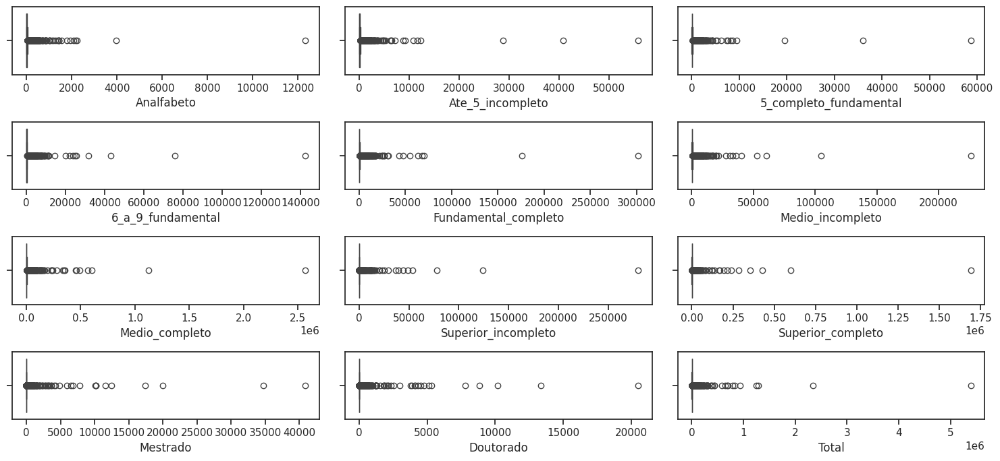
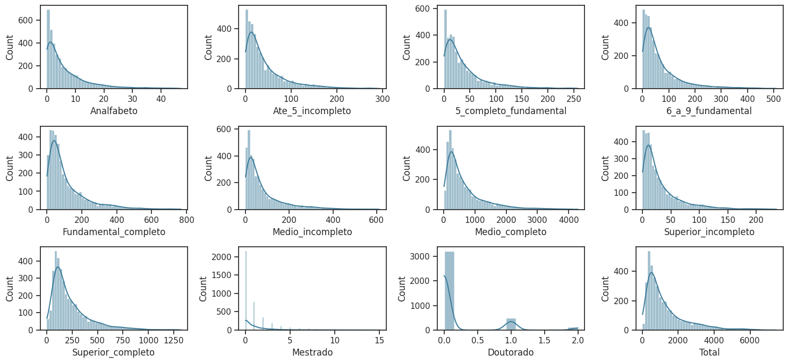
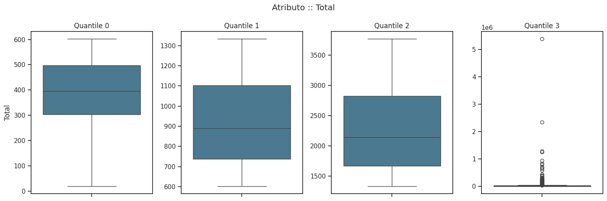

# Análise do Conjunto de Dados
A análise exploratória foi realizada para compreender melhor o conjunto de dados, focando na distribuição das variáveis, identificação de outliers e outros padrões relevantes.

## Variáveis do Conjunto de Dados

O conjunto de dados contém as seguintes variáveis, sem valores ausentes. Cada linha representa um município:

| **Variável**                 | **Descrição**                     | **Valores não nulos** | **Tipo**  |
|------------------------------|-----------------------------------|------------------------|-----------|
| Estado                      | Estado ao qual o município pertence | 5570                 | *object*  |
| Municipio                   | Nome do município                 | 5570                 | *object*  |
| Analfabeto                  | Número de pessoas analfabetas      | 5570                 | *int64*   |
| Ate_5_incompleto            | Pessoas com até 5 anos de estudo incompleto | 5570 | *int64* |
| 5_completo_fundamental      | Pessoas com 5 anos completos do fundamental | 5570 | *int64* |
| 6_a_9_fundamental           | Pessoas com 6 a 9 anos do fundamental | 5570 | *int64* |
| Fundamental_completo        | Pessoas com ensino fundamental completo | 5570 | *int64* |
| Medio_incompleto            | Pessoas com ensino médio incompleto | 5570 | *int64* |
| Medio_completo              | Pessoas com ensino médio completo | 5570 | *int64* |
| Superior_incompleto         | Pessoas com ensino superior incompleto | 5570 | *int64* |
| Superior_completo           | Pessoas com ensino superior completo | 5570 | *int64* |
| Mestrado                   | Pessoas com mestrado completo      | 5570                 | *int64*   |
| Doutorado                   | Pessoas com doutorado completo    | 5570                 | *int64*   |
| Total                       | População total do município       | 5570                 | *int64*   |

## Distribuição das Variáveis

Para compreender a distribuição das variáveis numéricas, foi gerado um **gráfico de BoxPlot**:

  

### Observações sobre o BoxPlot:
- O gráfico indica um grande número de **outliers**, o que dificulta a visualização da distribuição das variáveis.
- Esses outliers são principalmente associados a municípios com grandes populações.

### Outliers

Os valores identificados como outliers pelo BoxPlot correspondem, em sua maioria, a grandes municípios brasileiros. Destacam-se as seguintes cidades:

| **Município**         | **População Total** |
|-----------------------|----------------------|
| São Paulo             | 5.390.446           |
| Rio de Janeiro        | 2.339.294           |
| Belo Horizonte        | 1.287.288           |
| Brasília              | 1.250.053           |
| Curitiba              | 935.984             |
| Fortaleza             | 828.827             |
| Salvador              | 788.195             |
| Recife                | 703.180             |
| Porto Alegre          | 684.076             |
| Goiânia               | 643.009             |
| Manaus                | 582.757             |
| Belém                 | 433.899             |
| Campinas              | 433.812             |
| São Luís              | 394.063             |
| Guarulhos             | 376.358             |
| Barueri               | 367.439             |
| Florianópolis         | 311.473             |
| Campo Grande          | 307.059             |
| Natal                 | 307.027             |
| João Pessoa           | 301.635             |

#### Considerações:
- Esses valores elevados refletem a concentração populacional em capitais e grandes centros urbanos.
- Embora sejam classificados como outliers, representam um padrão natural devido às características populacionais do Brasil.

Essa análise inicial destaca a necessidade de ajustes nos métodos de visualização e, possivelmente, o agrupamento dos dados para uma avaliação mais clara da distribuição das variáveis. Observa-se que, ao removermos os valores considerados outliers pelo **BoxPlot**, os dados restantes apresentariam distribuições próximas a uma **distribuição Gamma**. 

  

Contudo, essa abordagem resultaria na exclusão de muitos municípios, restringindo a análise apenas às localidades com distribuições mais homogêneas. Isso poderia comprometer a representatividade e a abrangência da análise, já que os municípios mais populosos, que frequentemente influenciam a dinâmica econômica e social, seriam desconsiderados.

No entanto, agrupar os dados também não é uma tarefa trivial, pois cada região brasileira possui características distintas e únicas. Se optarmos por agrupar os dados com base na coluna Total (que representa a soma de todos os atributos), notamos que, mesmo dentro do grupo de "outliers", há valores extremamente discrepantes. Por exemplo, municípios como São Paulo e Belo Horizonte apresentam valores muito acentuados, como ilustrado na tabela anterior.

  

Esse comportamento evidencia que, mesmo ao segmentar os dados com base em um critério como o total populacional, ainda será necessário lidar com grandes disparidades dentro de cada grupo. Isso reforça a importância de desenvolver critérios adicionais para o agrupamento ou de adotar abordagens mais robustas que considerem essas diferenças regionais sem descartar informações relevantes.
