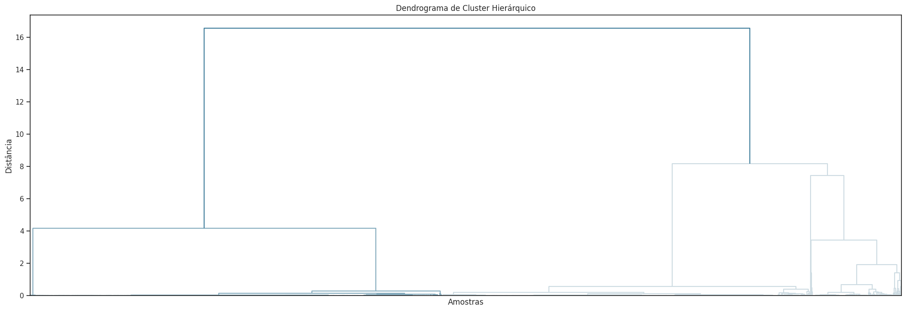
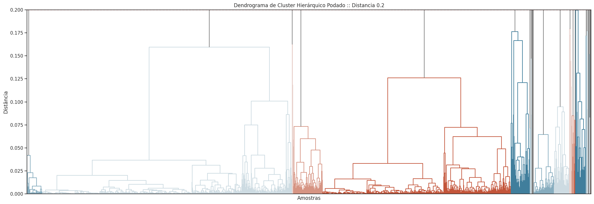
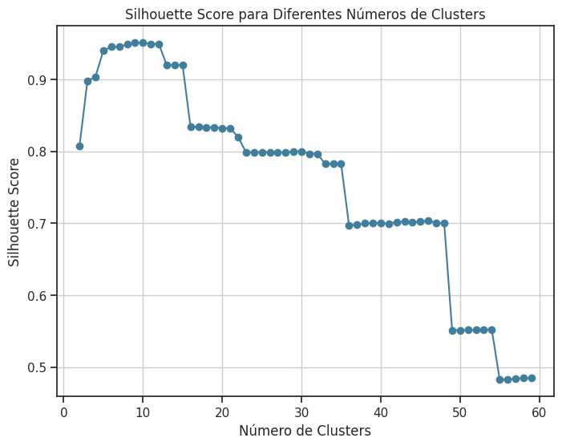
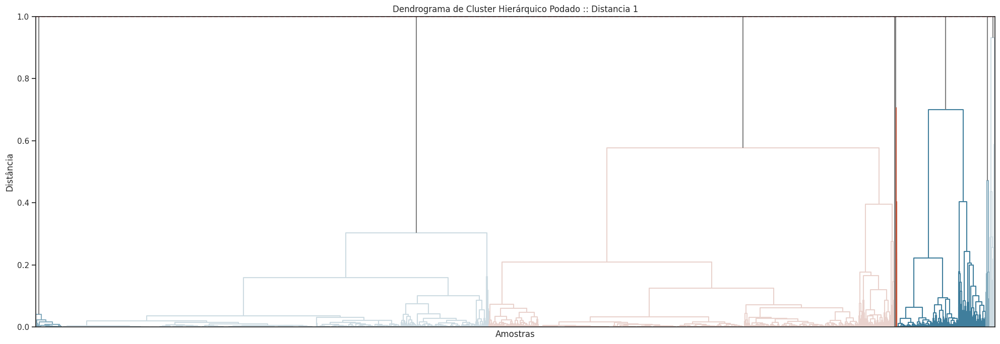

# Clusterização dos Municipios

Este tópico foi dedicado à tentativa de clusterizar os dados com o objetivo de verificar se seria interessante considerar os clusters formados, em vez das regiões e estados definidos pelo [IBGE](https://www.ibge.gov.br/). Para isso, foi utilizado o algoritmo Hierarchical Clustering, permitindo uma abordagem visual para observar o comportamento dos clusters formados.

  
   
  <a href="https://uc-r.github.io/hc_clustering">Fonte: https://uc-r.github.io/hc_clustering</a>

Para a formação dos clusters, foi considerado apenas os conjuntos de dados analisados nos tópicos anteriores,**EDA Setor Industrial**  e **EDA Pessoas em Cada Nível Educacional** , combinados com diferentes formas de pré-processamento e uma amostragem aleatória (Bootstrap), com o objetivo de gerar resultados mais significativos, avaliados a partir da **Medida de Silhueta** e **Davies Bouldin Score**.

## Dendogram
A fim de adotar uma abordagem visual na análise, foi inicialmente construído um dendrograma utilizando os dados disponíveis. Esses dados foram concatenados com base nos códigos dos municípios e, posteriormente, normalizados por meio da estratégia **MinMaxScale**. Esse processo de normalização é indispensável, pois o dendrograma se baseia em um critério de distância, o que poderia ser distorcido por variáveis com escalas discrepantes.

Entretanto, ao aplicar o algoritmo, constatou-se que, devido à heterogeneidade dos dados, as distâncias entre alguns clusters principais formados eram consideravelmente elevadas, indicando baixa similaridade entre eles. Essa característica dificultou a identificação clara da distribuição dos municípios nos grandes clusters gerados, além da formação de clusters desbalanceados.

  

Para aprimorar a compreensão dos clusters formados, foi definido um novo *threshold* baseado na distância. Contudo, como observado anteriormente, para identificar novos agrupamentos dentro do dendrograma, é necessário estabelecer um thresholder de valor baixo. Ao definir uma distância de $0.2$, formando 37 clusters ao total, tornou-se possível visualizar com maior clareza a formação de grupos mais bem delineados. Entretanto, também foi notada a formação de clusters com um número muito reduzido de municípios. Esse comportamento reforça, mais uma vez, a elevada diversidade presente nos dados analisados, ou até mesmo a presença de outliers.

  

Com o objetivo de determinar um número ideal de clusters cm base em uma métrica significativa, foi inicialmente empregada a medida de silhueta, sem a utilização da técnica de bootstrap — que será aplicada posteriormente para complementação da análise. Esse processo resultou na definição de 10 clusters.

  

Contudo, o resultado final não apresentou uma visualização satisfatória. Além disso, observou-se novamente a formação de clusters altamente desbalanceados, o que reforça a complexidade de agrupar os dados disponíveis. Alguns clusters mostraram-se extremamente grandes e internamente muito heterogêneos, com altas distâncias entre os elementos. Por outro lado, alguns clusters menores apresentaram-se mais limitados em tamanho, o que pode ser um indicativo da presença de ruídos nos dados analisados.

  

Esse aspecto que também foi identificado nos resultados da análise **EDA Pessoas em Cada Nível Educacional** , na seção de **Outliers**, no qual, evidenciou que a geração de clusters consistentes - utilizando o algoritmo **KMeans**, também baseado em distância - é um processo desafiador, quando se considera apenas os dados disponíveis, sem integrar o contexto espacial dos dados.

