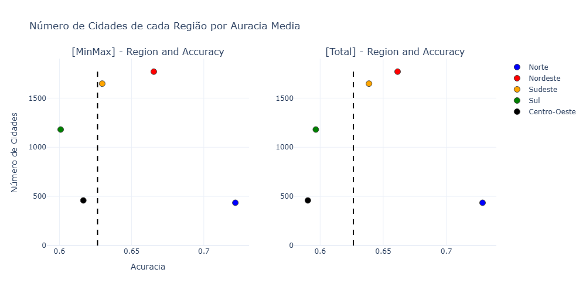
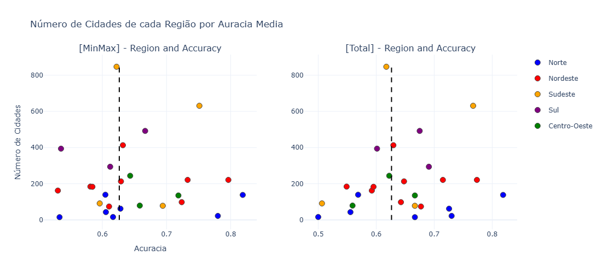

# Análise Inicial do Poder Preditivo a partir de Mudanças na Granularidade dos Dados

Este estudo tem como objetivo investigar se mudanças na granularidade dos dados podem melhorar a construção de modelos preditivos. O experimento foi conduzido seguindo a metodologia descrita abaixo:

1. **Modelo utilizado**: Um modelo baseado no ensemble **Random Forest** foi escolhido devido à sua capacidade de lidar com a diversidade dos dados.
2. **Pré-processamento**: Foram realizados dois tipos distintos de pré-processamento: 
   - **MinMaxScaler**, que escala os dados para um intervalo específico.
   - Divisão dos valores pelo atributo **Total** (CustomNorm), conforme utilizado em uma seção anterior.
3. **Validação cruzada**: Utilizamos validação cruzada estratificada com 5 folds para garantir maior robustez nas análises.
4. **Reprodutibilidade**: Uma semente fixa foi definida para todos os experimentos, assegurando a reprodutibilidade do processo. Além disso, foram mantidos os parâmetros padrão do scikit-learn.

A análise foi realizada em três níveis de granularidade:  
- **Modelo geral**: Incluindo todos os dados sem segmentação.  
- **Modelo por região**: Construindo modelos individualmente para cada região do Brasil.  
- **Modelo por estado**: Criando modelos específicos para cada estado.  

Para compreender melhor a relação entre quantidade e qualidade dos dados, foram gerados gráficos que mostram o número de municípios por região e estado, bem como a acurácia média obtida em cada caso a partir da validação cruzada.

## Modelo Geral
A princípio, avaliamos o poder preditivo criando apenas um modelo geral. Embora a acurácia tenha sido superior a 0,5, o F1-score muito baixo indica um desempenho insatisfatório, com dificuldades em generalizar, especialmente no equilíbrio entre precisão e recall. Em outras palavras, embora o modelo possa apresentar bons resultados em algumas classes, ele falha de forma significativa em outras, evidenciando dificuldades em generalizar de maneira eficaz para todas as classes.

| **Métrica**            | **Norm MinMax** | **Custom Norm** |
|------------------------|-----------------|-----------------|
| **Acurácia média**     | 0.6264          | 0.6078          |
| **F1-score médio**     | 0.3902          | 0.3676          |

- Valido notar que para este modelo a normalização **MinMax** obteve um melhor desempenho em comparação a **CustomNorm**, em ambas as métricas.

## Modelo por Região
Ao alterar a granularidade da análise, identificamos um ganho interessante no poder preditivo para as regiões Sudeste, Nordeste e Norte. No entanto, para as demais regiões, houve uma perda considerável em comparação com o modelo geral.

| **Região**       | **Norm MinMax - Acurácia** | **Norm MinMax - F1-score** | **Custom Norm - Acurácia** | **Custom Norm - F1-score** |
|------------------|----------------------------|----------------------------|----------------------------|----------------------------|
| **Norte**        | 0.7218 ± 0.02944           | 0.4289 ± 0.07084           | 0.7287 ± 0.02778           | 0.4594 ± 0.06319           |
| **Nordeste**     | 0.6654 ± 0.02209           | 0.4948 ± 0.0636            | 0.6614 ± 0.02698           | 0.4552 ± 0.06785           |
| **Sudeste**      | 0.6296 ± 0.01307           | 0.4016 ± 0.05393           | 0.6387 ± 0.01809           | 0.4192 ± 0.0843            |
| **Sul**          | 0.6008 ± 0.03447           | 0.357 ± 0.04437            | 0.5966 ± 0.02803           | 0.3484 ± 0.02209           |
| **Centro-Oeste** | 0.6166 ± 0.01737           | 0.425 ± 0.06114            | 0.5903 ± 0.03684           | 0.391 ± 0.06188            |

- **Vale destacar** o ganho significativo na métrica de F1-score em quase todos os cenários, indicando um melhor poder de generalização para todas as classes.

Além disso, é importante destacar que o número de amostras não está diretamente relacionado à qualidade do modelo. Regiões com um grande número de municípios não necessariamente apresentaram acurácias mais altas, assim como regiões com menos municípios também não tiveram os piores desempenhos. Esses resultados sugerem que há outros fatores além da quantidade de dados que influenciam o poder preditivo.

  

## Modelo por Estado

Ao construirmos modelos por estado, observamos um comportamento interessante, em alguns estados, houve um aumento expressivo no poder preditivo em termos de acurácia e f1-score, resultado este, que sugere a necessidade de análises mais aprofundadas para compreender melhor fatores como o nível econômico dos estados e a disponibilidade de dados mais representativos, uma vez que, mesmo dentro de uma mesma região, foram observadas grandes diferenças no desempenho dos modelos, evidenciando novamente que **variáveis locais** podem ter impacto significativo nos resultados.

| **Estado** | **MinMaxNorm - Acurácia** | **MinMaxNorm - F1-score** | **CustomNorm - Acurácia** | **CustomNorm - F1-score** |
|------------|---------------------------|---------------------------|---------------------------|---------------------------|
| **RO**     | 0.6056 ± 0.1343            | 0.3789 ± 0.107            | 0.5556 ± 0.1165           | 0.3388 ± 0.1223           |
| **AC**     | 0.78 ± 0.1288              | 0.4881 ± 0.2645           | 0.73 ± 0.06782            | 0.396 ± 0.07327           |
| **AM**     | 0.6282 ± 0.08667           | 0.3467 ± 0.06456          | 0.7256 ± 0.08421          | 0.3959 ± 0.1003           |
| **RR**     | 0.5333 ± 0.2667            | 0.32 ± 0.16               | 0.6667 ± 0.0              | 0.4533 ± 0.1067           |
| **PA**     | 0.6048 ± 0.04151           | 0.345 ± 0.07785           | 0.5688 ± 0.05676          | 0.2914 ± 0.07527          |
| **AP**     | 0.6167 ± 0.1453            | 0.4244 ± 0.1521           | 0.5 ± 0.1491              | 0.2822 ± 0.09828          |
| **TO**     | 0.8188 ± 0.00324           | 0.3511 ± 0.1271           | 0.8188 ± 0.00324          | 0.342 ± 0.1117            |
| **MA**     | 0.629 ± 0.02824            | 0.4159 ± 0.1119           | 0.648 ± 0.03899           | 0.374 ± 0.1074            |
| **PI**     | 0.7964 ± 0.02496           | 0.4341 ± 0.1019           | 0.7736 ± 0.02951          | 0.3147 ± 0.02913          |
| **CE**     | 0.5814 ± 0.09509           | 0.6405 ± 0.1012           | 0.5489 ± 0.02031          | 0.4155 ± 0.1061           |
| **RN**     | 0.5307 ± 0.04696           | 0.4963 ± 0.1791           | 0.5924 ± 0.03181          | 0.4722 ± 0.1429           |
| **PB**     | 0.7329 ± 0.05305           | 0.4381 ± 0.1041           | 0.7149 ± 0.01771          | 0.2994 ± 0.05282          |
| **PE**     | 0.5845 ± 0.04871           | 0.5608 ± 0.128            | 0.5953 ± 0.073            | 0.4447 ± 0.1378           |
| **AL**     | 0.7237 ± 0.07397           | 0.4578 ± 0.1834           | 0.6426 ± 0.1051           | 0.4332 ± 0.218            |
| **SE**     | 0.6105 ± 0.1017            | 0.5015 ± 0.1659           | 0.6771 ± 0.07343          | 0.5516 ± 0.1318           |
| **BA**     | 0.632 ± 0.04933            | 0.428 ± 0.08893           | 0.6296 ± 0.06468          | 0.38 ± 0.08965            |
| **MG**     | 0.6222 ± 0.02091           | 0.4923 ± 0.06016          | 0.6174 ± 0.01046          | 0.4791 ± 0.06223          |
| **ES**     | 0.6942 ± 0.08715           | 0.4199 ± 0.1271           | 0.6667 ± 0.07365          | 0.3981 ± 0.09306          |
| **RJ**     | 0.5959 ± 0.1442            | 0.4862 ± 0.1495           | 0.5064 ± 0.04939          | 0.3452 ± 0.09287          |
| **SP**     | 0.7512 ± 0.02335           | 0.4486 ± 0.0615           | 0.7671 ± 0.0434           | 0.4912 ± 0.05476          |
| **PR**     | 0.5356 ± 0.03801           | 0.4081 ± 0.05691          | 0.6014 ± 0.05927          | 0.4802 ± 0.1426           |
| **SC**     | 0.6122 ± 0.01709           | 0.5564 ± 0.09091          | 0.6908 ± 0.06532          | 0.6587 ± 0.1016           |
| **RS**     | 0.6667 ± 0.04574           | 0.4216 ± 0.06462          | 0.675 ± 0.04746           | 0.391 ± 0.08823           |
| **MS**     | 0.6583 ± 0.06264           | 0.4991 ± 0.1772           | 0.5592 ± 0.1382           | 0.3526 ± 0.1685           |
| **MT**     | 0.7185 ± 0.01814           | 0.4693 ± 0.07748          | 0.6667 ± 0.06197          | 0.2987 ± 0.04407          |
| **GO**     | 0.6434 ± 0.05144           | 0.5594 ± 0.1103           | 0.6224 ± 0.09441          | 0.5382 ± 0.1497           |

- **Vale destacar** o ganho significativo na métrica de F1-score em quase todos os cenários, indicando um melhor poder de generalização para todas as classes.

  

- **Vale destacar** o número de amostras não está diretamente relacionado à qualidade dos dados e do modelo. 

## Considerações Finais

De modo geral, ficou claro que, ao ajustarmos a granularidade, é possível construir modelos melhores. No entanto, esse processo também pode expor limitações, como a falta de representatividade nos dados. Além disso, foi evidenciado que um grande número de amostras não implica necessariamente em maior poder preditivo, reforçando a importância da qualidade das informações.

Por fim, destaca-se que tanto regiões quanto estados podem ter seu poder preditivo aprimorado quando ajustamos as etapas de normalização. Isso evidencia a necessidade de adaptar o pré-processamento de acordo com a granularidade escolhida, considerando também as características específicas dos dados de cada região ou estado, como variáveis locais, relações espaciais, entre outras.
