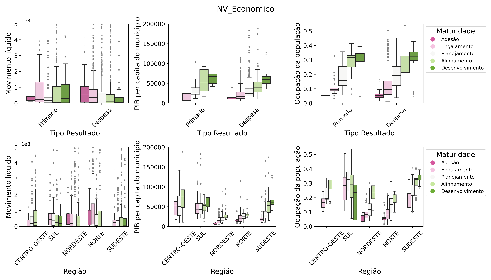
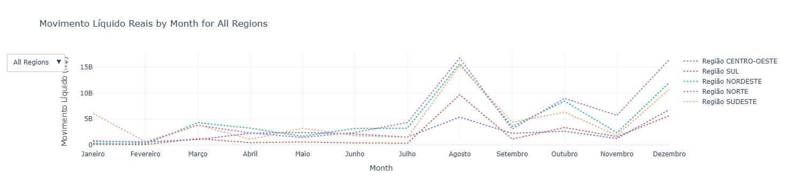

# Análise e pré-processamento dos dados

Nessa seção são descritas as atividades realizadas na primeira etapa do projeto, a saber a **integração** das bases escolhidas em primeiro momento, o **pré-processamento** realizado e as **análises preliminares** a partir do primeiro contato com as bases. 

## Bases escolhidas
### Dados de maturidade das cidades - Plataforma Inteli.gente (sem data divulgada)

De acordo com informações no site da iniciativa, 

*"A plataforma inteli.gente apresenta um diagnóstico do nível de maturidade para subsidiar a construção de políticas públicas em todas as cidades do país. A plataforma possui sete níveis de maturidade, sendo o número sete o mais elevado. Os níveis 1 (Adesão) e 2 (Engajamento) são resultados de uma ampliação para o Brasil, a partir do SSC-MM da União Internacional de Telecomunicações (ITU) que recomenda cinco níveis de maturidade."*

Nesse contexto, toma-se como objetivo do trabalho estudar o **nível de maturidade econômica** da cidades. Não é necessário intenso pré-processamento, somente a imputação de valores faltantes da variável "População Ocupada", feita através do valor mediano de cidades com mesma região, faixa de população e PIB *per capita*.

**fonte dos dados:** Scrapping realizado pelo integrante Thiago Ambiel.

### Dados geográficos - IBGE (2021)
Adiciona-se à base de maturidade informações geográficas, como à qual região imediata/intermediária (classificação IBGE) é relacionada cada município e dados sobre a geometria dos municípios, utilizados nas visualizações.

De acordo com definição do IBGE, substituindo as unidades mesorregionais e microrregionais, vigentes desde a década de 90, 
- **Regiões Geográficas Imediatas** correspondem às áreas que procuram centros urbanos próximos para satisfação de necessidades imediatas como emprego, saúde, educação, compras de bens de consumo e prestação de serviços públicos;
- **Regiões Geográficas Intermediárias** organizam as Imediatas no território a partir de uma região que oferece serviços mais complexos como serviços médicos especializados ou grandes universidades.

**fonte dos dados:** https://www.ibge.gov.br/geociencias/organizacao-do-territorio/malhas-territoriais/15774-malhas.html

### Dados de investimento - Ministério da Fazenda (2023)

Os dados são obtidos via "Portal de Dados Abertos" do Governo Federal, além disso também são disponibilizados os metadados (fornecem informações adicionais sobre as features). O orgão responsável pelos dados é o Ministério da Fazenda (MF), e a descrição para o conjunto de dados e definição de conceitos de domínio são relacionados abaixo.

- **Descrição da base:** "Corresponde ao pagamento (despesas do exercício pagas e restos a pagar pagos) dos grupos de natureza de despesa 4 (investimentos) e 5 (inversões financeiras exceto as despesas financeiras, que compõem o Orçamento Fiscal e da Seguridade Social.
- **Investimentos:** são despesas orçamentárias com **softwares** e com o **planejamento e a execução de obras**, inclusive com a aquisição de imóveis considerados necessários à realização destas últimas, e com a **aquisição de instalações, equipamentos e material permanente**.
- **Inversões financeiras:** são despesas orçamentárias com a **aquisição de imóveis ou bens de capital já em utilização**; **aquisição de títulos** representativos do capital de empresas ou entidades de qualquer espécie, já constituídas, quando a operação não importe aumento do capital; e com a constituição ou aumento do capital de empresas, além de outras despesas classificáveis neste grupo.
- Os dados são obtidos a partir de consultas junto ao **Sistema Integrado de Administração Financeira do Governo Federal – SIAFI.**"

No primeiro contato com a base não são encontrados valores faltantes, e o pré-processamento consiste em padronizar o nome das variáveis. É feita uma exploração nas variáveis categóricas, pormenorizada no notebook dessa seção, e são tomadas as seguintes decisões de projeto:

- **Tipo de orçamento:** Focar inicialmente no Orçamento fiscal - isso permitirá verificar se o nível de investimento em orgãos públicos terá relação direta com o nível de maturidade do município;
- **Grupo Despesa:** Focar inicialmente em Investimentos - devido à natureza da destinação de recursos (softwares, obras, instalações, equipamentos, etc);
- **Resultado primário:** Focar inicialmente em resultado primário e despesa no geral - um estudo sobre as despesas poderá ser realizado, talvez considerando o tipo de emenda (despesas) e a obrigatoriedade (primário);
- **Região de aplicação:** Não contemplar investimentos que sejam no exterior, sem informação ou a nível nacional. Uma vez que a granularidade dos indicadores de maturidade é a nível municipal, a mesma granulariadade será adotada em primeiro momento.

As definições dos termos técnico estão no notebook, e a razão é induzir o leitor a explorar as análises realizadas. Com base nas decisões de projeto acima, é realizada a filtragem final dos dados de interesse.

**fonte dos dados:** https://dados.gov.br/dados/conjuntos-dados/investimento-publico

**fonte metadados:** https://www.tesourotransparente.gov.br/ckan/dataset/e048826b-b6b0-4d92-9204-fd218b1f25b3/resource/91cbf16f-19e6-48e4-b059-12b7a0758d25/download/Metadados-Investimentos.pdf

## Visualizações exploratórias

### Dados Maturidade

Valores em rosa/roxo representam o menor nível de maturidade (Adesão e Engajamento), e os verde os maiores (Alinhamento e Desenvolvimento). Focando a análise no nível economico, são feitas análises envolvendo o *tipo de aplicação do investimento* (primeira linha) e *regionalmente* (segunda linha). Para cada grupo, são selecionadas as variáveis *Movimento líquido* (montante investimento, na esquerda), *PIB per capita* (meio) e *ocupação da população* (direita).

<!-- - **Despesa primária (Movimento líquido):** Dividindo os investimentos em Primário e Despesa (definidos acima), para resultado primário as medianas são semelhantes não importando o nível de maturidade, enquanto entre despesas observa-se que existem padrões de crescimento/decaimento conforme o nível de maturidade da cidade. Porém, o mesmo comportamento é observado tanto em relação à resultado primário quanto à despesa, indicando que fazer essa distinção não é relevante. -->
- **Despesa primária (Movimento líquido):** Dividindo os investimentos em Primário e Despesa (definidos acima), para resultado primário as medianas são semelhantes não importando o nível de maturidade, enquanto entre despesas observa-se um padrão interessante de decaimento conforme maior nível de maturidade da cidade. *Isso pode indicar que cidade mais maduras tem melhores condições de governança pública*, porém uma investigação mais aprofundada é necessária. Variação regionais (segunda linha) são observadas.
- **PIB e ocupação:** Observando os casos do tipo de resultado (primeira linha), nota-se o mesmo comportamento entre níveis, não importando se Resultado primário ou despesa. Se tratando dos casos agregados regionalmente (segunda linha), observa-se que existem padrões distintos entre níveis de acordo com a região.

**Conclusão:** Foi verificado que, quando considerando PIB per capita e Ocupação da população, agrupar casos entre o tipo de resultado do investimento não produz padrões distintos. Quando analisados os *casos regionais são observados padrões distintos*, indicando que uma **análise regional é necessária** para tratar das heterogeneidades locais.

### Dados investimento público

Os dados de investimento são exibidos através de gráficos de linha, sendo possível visualizar os 26 estados e Distrito Federal (Estados em linha cheia e região tracejada) e uma visualização comparando as regiões.

Possíveis análises da dimensão temporal e sua relação com o volume de recursos

- Pico em agosto, outubro e dezembro, para todas as regiões
- Após recesso parlamentar de julho, são liberados mais recursos?
- O inverso ocorre em Dezembro, com liberação de recursos antes do recesso parlamentar de Janeiro?
- Datas festivas (padroeira e fim de ano)?
- Qual impacto de eleições (anos pares)?

# Conclusão da primeira etapa

Através da análise dos box-plots com os níveis de maturidade, existem padrões regionais locais, o que será explorado nas próximas seções. Quanto às variáveis analisadas, o volume de investimentos exige uma análise aprofundada para verificar sua influência no nível de maturidade econômica. Além disso, a relação da maturidade com PIB per capita e porcentagem da população ocupada é evidente - e também será alvo de investigação nas próximas seções.

Próxima etapa: **Qualidade da amostra**  
