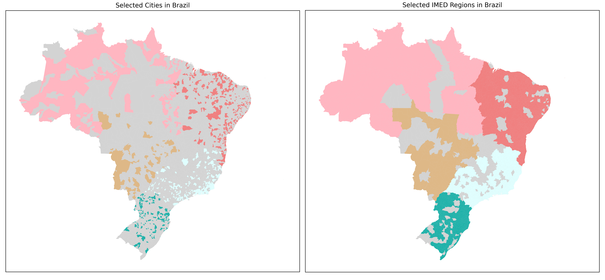
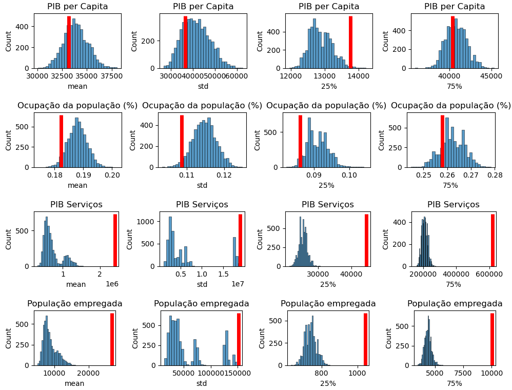
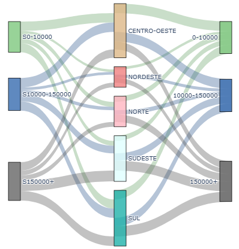
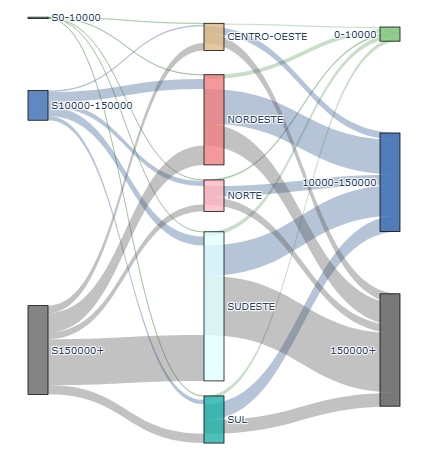

# Análise geográfica e Avaliação da amostra
Dada a conclusão da última seção, é iniciada uma análise geográfica dos dados de investimento. Porém, surge um desafio logo no início da análise: a quantidade de localidade com investimentos em 2023. É feita uma suposição sobre como considerar o efeito do investimento, um estudo simplificado utilizando simulações com amostragens, e o uso de gráficos Sankey para comparar visualmente a amostra com o todo. 

 ## Representatividade da "amostra" de municípios com investimentos
 
### Cobertura geográfica
Dada a conclusão da última seção, é iniciada uma análise geográfica dos dados de investimento. Porém, surge um desafio logo no início da análise: a quantidade de investimentos por localidade em 2023, conforme ilustrado abaixo. Somente 1055 dos 5570 municípios brasileiros tiveram investimentos de origem Federal em 2023.

&nbsp;&nbsp;&nbsp;&nbsp;&nbsp;&nbsp;&nbsp;&nbsp; &nbsp;&nbsp;&nbsp;&nbsp;&nbsp;&nbsp; a) Municípios com investimentos Federais em 2023 &nbsp;&nbsp;&nbsp;&nbsp;&nbsp;&nbsp;&nbsp;&nbsp;&nbsp;&nbsp;&nbsp;&nbsp;&nbsp;&nbsp;&nbsp;&nbsp;&nbsp;&nbsp;&nbsp;&nbsp; &nbsp;&nbsp; b) Regiões Imediatas com investimentos Federais em 2023

 É **levantada a suposição** que o investimento em uma localidade não tem efeitos concentrados somente nessa localização. A melhoria de um serviço público em uma cidade do interior, por exemplo, pode fazer com que habitantes do entorno passem a usufruir desse serviço. Portanto, é feito o prenchimento das cores das cidades que pertencem à *Região Imediata* (IBGE) da localidade que recebeu o investimento, em conformidade com o definido na seção anterior.
 
 Mesmo com essa medida ainda existem muitas lacunas na imagem acima, de forma que **nesse momento do projeto almeja-se propor uma metodologia para inferir valores faltantes** com base no investimento em cidades vizinhas, de acordo com a suposição enunciada. Portanto, a evolução natural é realizar uma análise da qualidade e representatividade da "amostra" em mãos.

 
### Simulação através de amostragens aleatórias
A primeira metodologia para verificar a representatividade das cidades em relação à realidade do Brasil é através de amostragem, sem reposição, da totatilidade das cidades. Uma vez que o número de municípios com investimento é da ordem de grandeza de mil casos, são realizadas 5000 amostragens de 1000 cidades, calculando a média, desvio padrão, primeiro e terceiro quartis. A metodologia acima é realizada com 5 variáveis de interesse, PIB *per capita*/Serviços/Indústria, População empregada e a variável criada Ocupação Populacional (que é a porcentagem de habitantes com emprego na cidade), e os resultados selecionados são exibidos abaixo.

É evidente que a "normalização" das variáveis tem efeito relevante, e por normalização entenda-se variáveis que são proporções, principalmente no PIB *per capita*. Comparar valores absolutos, como PIB de serviços ou a quantidade de pessoa empregadas na cidade, gera muitas distorções ao tentar avaliar ao mesmo tempo Descalvado e São Paulo por exemplo, ou mesmo Sâo Carlos e Campinas. Porém, observa-se que Ocupação da população não apresenta estatísticas semelhantes às amostragens das cidades, de forma que as **próximas análises utilizarão PIB per capita**. Com esse raciocínio, prossegue-se na análise buscando correspondências em relação à região e população.

### Análise visual utilizando Sankey Plots

Nos gráficos abaixo busca-se comparar a amostra (esquerda, "Sx") com todos os municípios brasileiros (direita, "x"). Com essa análise, almeja-se verificar a relação entre a região (meio) e a população das cidades, classificando-as como cidades com até 10.000 habitantes, entre 10.000 e 150.000 habitantes e acima de 150.000 habitantes. 

a) Comparando PIB *per capita*&nbsp;&nbsp;&nbsp;&nbsp;&nbsp;&nbsp;&nbsp;&nbsp;&nbsp;&nbsp;&nbsp;&nbsp;&nbsp;&nbsp;&nbsp;&nbsp;&nbsp;&nbsp;&nbsp;&nbsp;&nbsp;&nbsp;&nbsp;&nbsp;&nbsp;b) Comparando Ocupação da População&nbsp;&nbsp;&nbsp;&nbsp;&nbsp;&nbsp;&nbsp;&nbsp;&nbsp;&nbsp;&nbsp;&nbsp;&nbsp;&nbsp;&nbsp;&nbsp;c) Comparando população empregada  <!-- podia fazer melhor kkkkkk  preguiça-->

  
   
   

Aparentemente, as variáveis "normalizadas" apresentam proporções similares entre as regiões, e no caso com valores absolutos observam-se algumas incongruências, principalmente nas cidades com 10.000~150.000 habitantes.

# Conclusão

Com base nas análises realizadas, elege-se os dados de PIB *per capita* como mais representativos. Ressalta-se que, nesse momento do desenvolvimento do projeto, ainda era esperado realizar a tarefa de distribuição dos valores de investimento regionalmente, de acordo com a suposição levantada no início desta seção, e o PIB *per capita** seria utilizado para correlacionar os investimentos e fazer uma regressão espacial.

Próxima etapa:  **Exploração biblioteca GIS - Pysal**  
