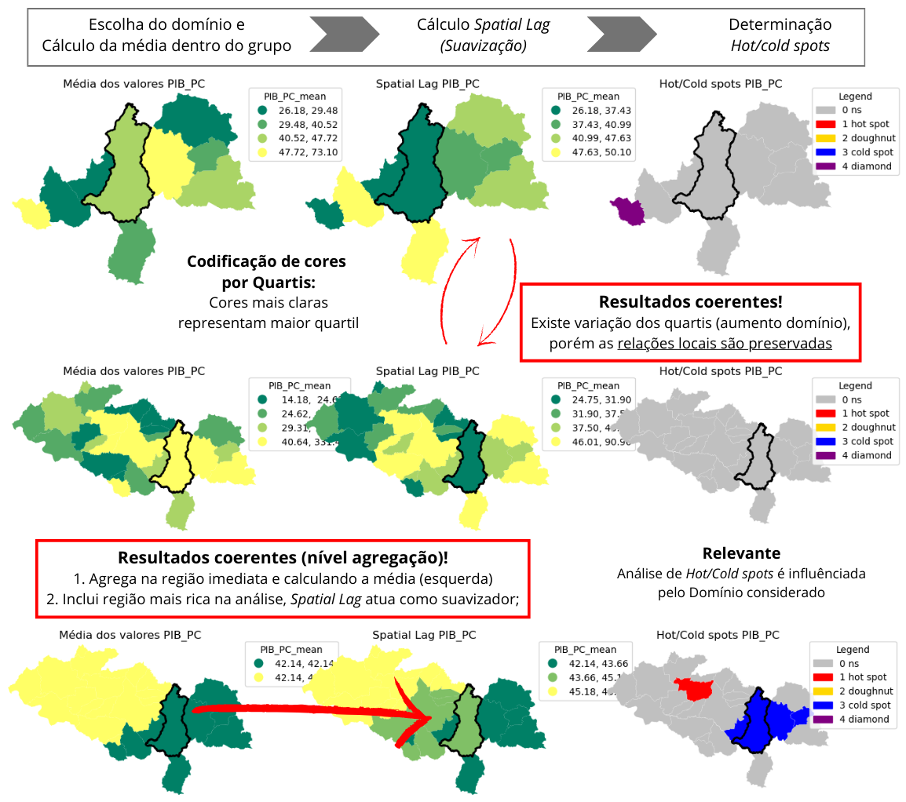
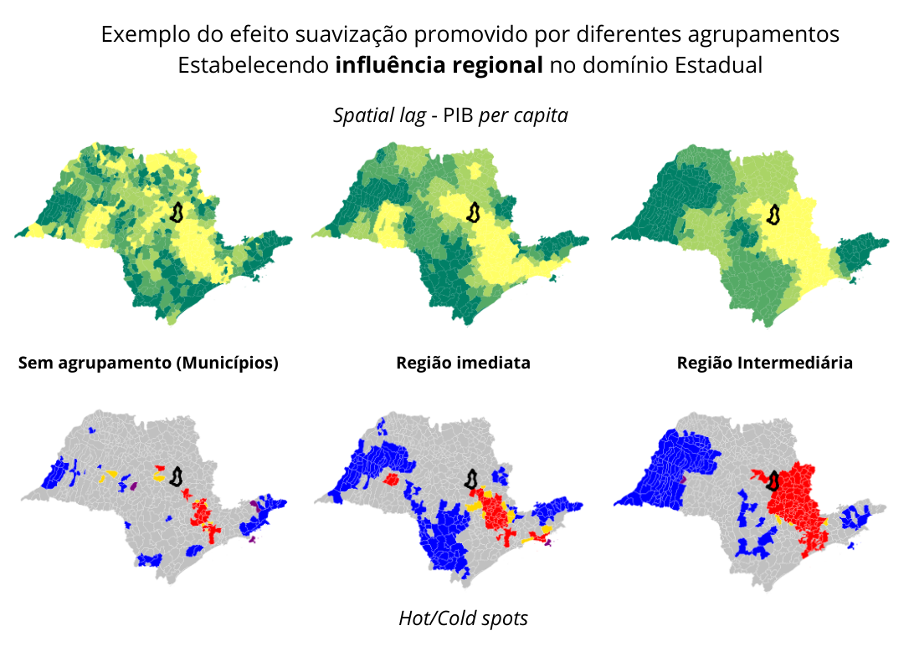
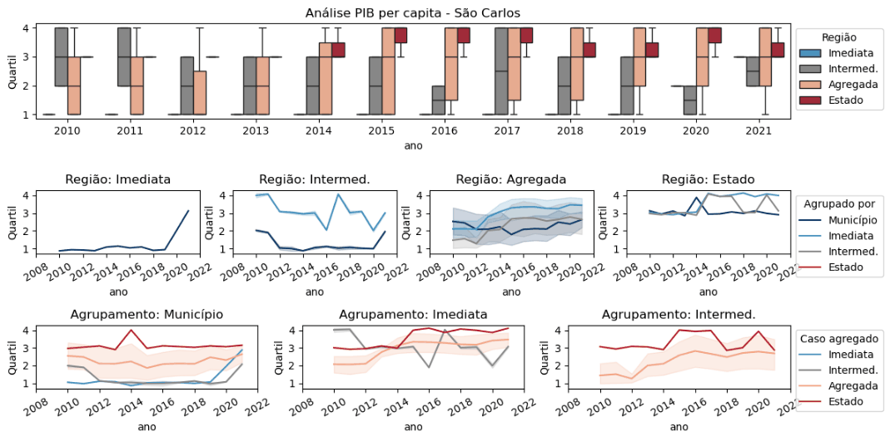
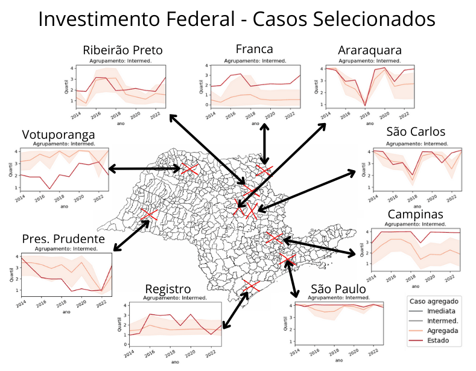
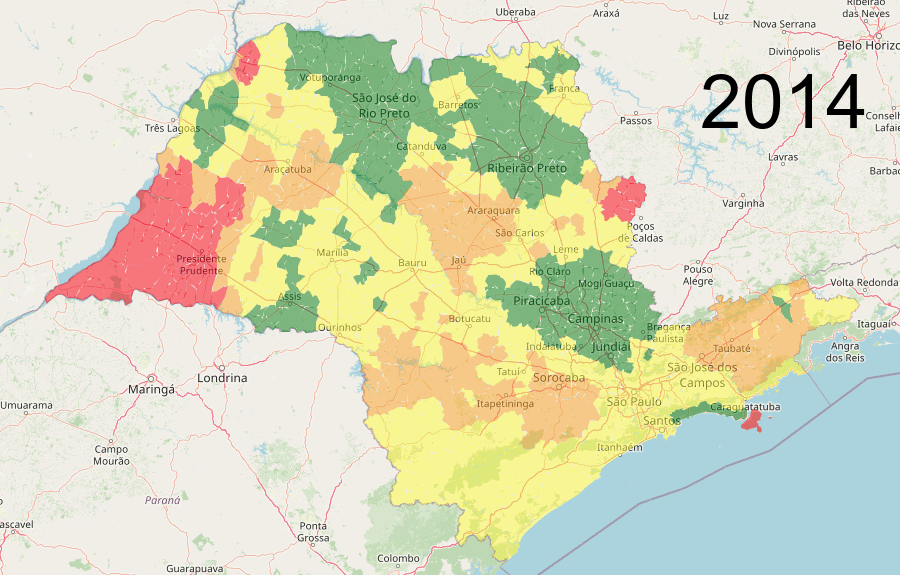
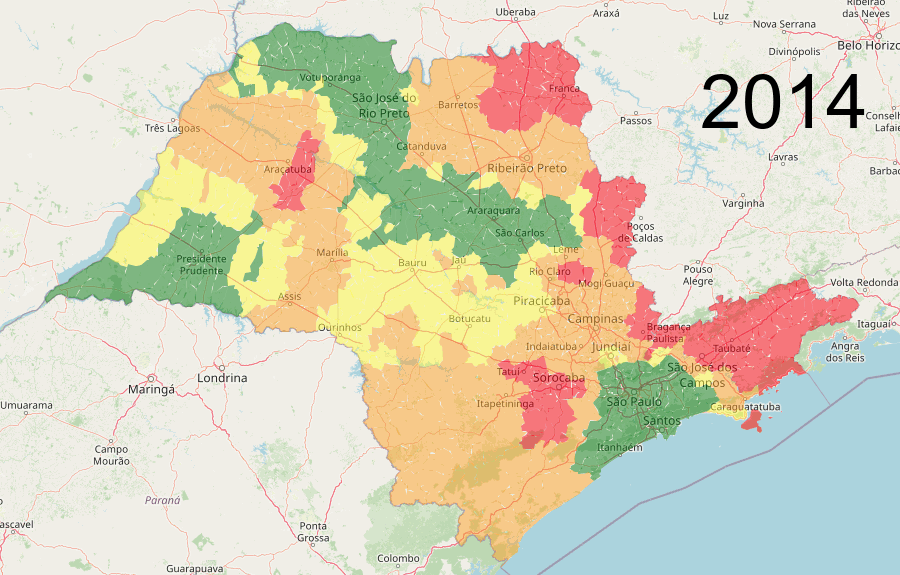
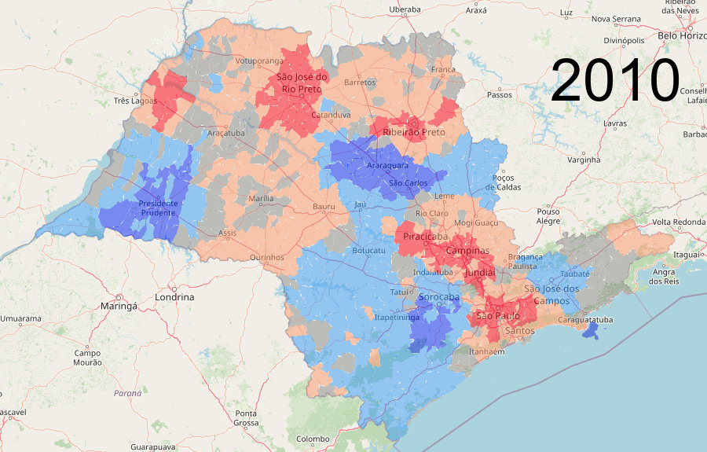
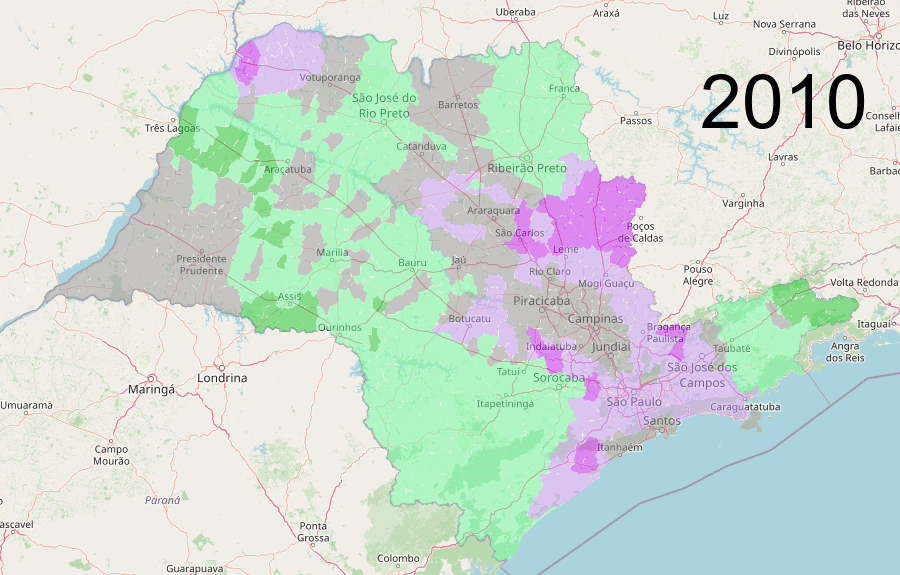
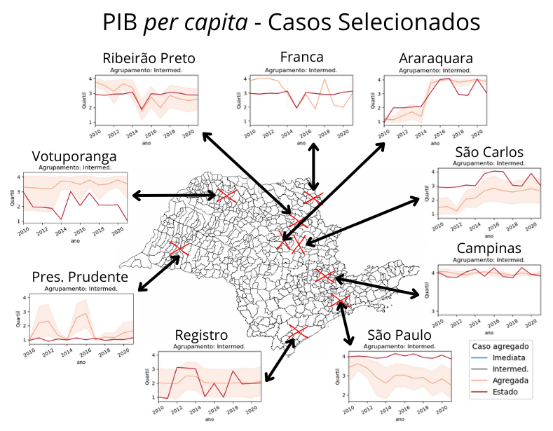

# Definição de novo objetivo - **Influência regional** 

Nessa etapa do projeto, à época da execução, é tomada a decisão de abandonar o objetivo inicial, que seria definir uma metodologia para distribuir valores de investimentos, buscando modelar seu benefício para a população - e usar esses dados para inferir o nível de maturidade. Porém, conforme exposto na última seção, **não havia segurança sobre a significância dos resultados dessa abordagem** (seriam basicamente números sem garantia de significado), portanto é tomada a decisão de investigar a dinâmica de relevância regional nos municípios paulistas.

Para isso, é expandida a base de dados, buscando realizar uma análise espaço-temporal. São coletados os dados de PIB *per capita* do período de 2010 à 2021, e os dados de investimentos Federais do período entre 2014 e 2023. A disparidade entre os casos impediu uma análise pareada, e pode ser tópico de projetos futuros (por exemplo, como estimar os valores de anos anteriores/posteriores com base nos dados pareados?). Os dados tem o mesmo tratamento dispensado na Seção 3.1 (), e portanto não são exibidos novamente.

# Análise Espaço-Temporal
## Estudo de caso - São Carlos
### Analisando parâmetros importantes - Vizinhança para agrupamento e Domínio considerado

Considerando as funcionalidades da biblioteca PySAL, apresentadas na seção anterior, é feito o desenho de um experimento variando o Domínio considerado (Regiões Imediata, Intermediária, Agregada e Estadual) e a granularidade da vizinhança (Município, Imediata, Intermediária, Agregada e Estadual) para o agrupamento das cidades, que é utilizado no cálculo do *Spatial Lag* e *Hot/COld spots*. A descrição da metodologia é exibida abaixo, assim como a verificação realizada para conferir se os resultados obtidos são coerentes. É proposto um Domínio adicional aos definido pelo IBGE, denominado **Região Agregada** (granularidade entre Reg. Intermediária e Estadual), baseada no cálculo de *Spatial Lag*, no qual são consideradas todas as Reg. Imediatas vizinhas à Reg. Imediata da cidade em análise.

&nbsp;&nbsp;&nbsp;&nbsp;&nbsp;&nbsp;&nbsp;&nbsp;&nbsp;&nbsp;&nbsp;&nbsp;&nbsp;&nbsp;&nbsp;&nbsp; &nbsp;&nbsp;&nbsp;&nbsp;&nbsp;&nbsp;&nbsp;&nbsp;&nbsp;&nbsp;&nbsp;&nbsp;&nbsp;&nbsp;&nbsp;&nbsp;&nbsp;&nbsp;&nbsp;&nbsp;&nbsp;&nbsp; &nbsp;&nbsp;&nbsp;&nbsp;&nbsp;&nbsp;&nbsp;&nbsp;&nbsp;&nbsp;&nbsp;&nbsp;&nbsp;&nbsp;&nbsp; **Metodologia Proposta e Teste de Sanidade**
 

Sobre as relações locais preservadas com a inclusão de novos casos (mudança de Domínio mantendo nível de agrupamento), observa-se que a relação entre quartis, na região Imediata de São Carlos (primeira linha) e considerando as mesmas cidades na região Intermediária (segunda linha), se mantem, ou seja, quartis maiores continuam maiores e vice e versa. SObre a mudança de agrupamento mantendo o mesmo Domínio (segunda e terceira linhas), e observa-se o efeito suavizador obtido ao aumentar a granularidade do agrupamento. Por fim, há indícios de que aumentar o Domínio considerado, assim como aumentar a granularidade no mesmo Domínio, tem efeitos de detectar *Hot/Cold spots* .

### Influência regional depende da perspectiva
Seguindo o raciocínio anterior, os resultados experimentais revelam os principais efeitos da variação de vizinhança para agrupamento. O primeiro diz respeito às mudanças no *Spatial Lag*, em que a suavização é proporcional à granularidade, ou seja, quanto maior a vizinhança a ser agrupada (Região Intermediária, como exemplificado abaixo) maior a suavização do *Spatial Lag*. O outro efeito, já notado anteriormente, é a emergência de *Hot/Cold spots* no mesmo Domínio com o aumento da vizinhança agrupada.

&nbsp;&nbsp;&nbsp;&nbsp;&nbsp;&nbsp;&nbsp;&nbsp;&nbsp;&nbsp;&nbsp;&nbsp;&nbsp;&nbsp;&nbsp;&nbsp; &nbsp;&nbsp;&nbsp;&nbsp;&nbsp;&nbsp;&nbsp;&nbsp;&nbsp;&nbsp;&nbsp;&nbsp;&nbsp;&nbsp;&nbsp;&nbsp;&nbsp;&nbsp;&nbsp;&nbsp;&nbsp;&nbsp; &nbsp;&nbsp;&nbsp;&nbsp;&nbsp;&nbsp;&nbsp;&nbsp;&nbsp;&nbsp;&nbsp;&nbsp;&nbsp;&nbsp;&nbsp; **Impacto da variação da vizinhança para agrupamento**
  

 A princípio, as conclusões expostas dos resultados experimentais, nesse ponto do projeto, indicavam que as análises deveriam ser direcionadas considerando Domínios mais abrangentes e vizinhanças amplas. Porém, uma vez que o novo objetivo do projeto é explorar a dinâmica de relevância/influência regional, não era desejado perder dados sobre lideranças locais. Além disso, todas as conclusões foram tiradas tomando em conta somente o ano de 2020, e verificar essa dinâmica ao longo do tempo é o tema da próxima análise.

### Quartis como métrica de comparação/avaliação

Buscando a comparabilidade dos resultados e robustez contra as variações entre municípios (tamanho da população e riqueza por exemplo), e a exemplo da escolha do PIB *per capita* ao invés dos valores absolutos descrito em seção anterior, elege-se os quartis "regionais" como métrica. Essa era uma escolha natural pelo andamento da análise, por ser uma forma adimensional de ordenar os casos, permitindo comparações imediatas.  Pelas razões já descritas, é feita a análise temporal (primeira linha mostra as distribuições dos quartis em cada ano, para cada domínio), e os resultados das variações no Domínio (segunda linha, para cada tipo de agrupamento) e na vizinhança a ser agrupada (terceira linha, para cada Domínio), com os resultados e uma explicação visual abaixo.

&nbsp;&nbsp;&nbsp;&nbsp;&nbsp;&nbsp;&nbsp;&nbsp;&nbsp;&nbsp;&nbsp;&nbsp;&nbsp;&nbsp;&nbsp;&nbsp; &nbsp;&nbsp;&nbsp;&nbsp;&nbsp;&nbsp;&nbsp;&nbsp;&nbsp;&nbsp;&nbsp;&nbsp;&nbsp;&nbsp;&nbsp;&nbsp;&nbsp;&nbsp;&nbsp;&nbsp;&nbsp;&nbsp; &nbsp;&nbsp;&nbsp;&nbsp;&nbsp;&nbsp;&nbsp;&nbsp;&nbsp;&nbsp;&nbsp;&nbsp;&nbsp;&nbsp;&nbsp; &nbsp;&nbsp;&nbsp;&nbsp;&nbsp;&nbsp;&nbsp;&nbsp;&nbsp;&nbsp;&nbsp;&nbsp; **Análise Temporal dos Quartis "Regionais"**
 

Interpretando os resultados, nota-se que a Região Agregada proposta promove o diferencial de imbuir múltiplas perspectivas da relevância de uma cidade. Aliado às conclusões obtidas anteriormente, de que Domínios maiores induzem à uma maior suavização e detecção de *Hot/Cold spots*, é decidido trabalhar nas **análises finais com os Domínios de Região Agregada e Estadual, e agrupamento feito com vizinhanças de Região Intermediária.**

## Escolha da variável de análise: PIB x Investimentos
Considerando as conclusões no item anterior, são decididos o Domínio e granularidade de vizinhança, porém ainda é necessário definir se as variáveis escolhidas (PIB *per capita* e Investimentos Federais) apresentam padrões relevantes para a análise, de forma que uma exploração nesse sentido é desenvolvida.

### Explorando padrões à nivel Estadual

São selecionadas 9 municípios, de diferentes portes e regiões do estado, para realizar essa análise. Não é notado um padrão facilmente detectável, porém nota-se algumas particularidades. **Ribeirão Preto e Araraquara** tem quartis regionais de Estado e Agregada parelhos para as duas variáveis, o mesmo ocorre entre **Franca e Campinas**, **São Carlos e São Paulo** e em certa medida **Votuporanga e Presidente Prudente**.

&nbsp;&nbsp;&nbsp;&nbsp;&nbsp;&nbsp;&nbsp;&nbsp;&nbsp;&nbsp;&nbsp;&nbsp;&nbsp;&nbsp;&nbsp;&nbsp; &nbsp;&nbsp;&nbsp;&nbsp;&nbsp;&nbsp;&nbsp;&nbsp;&nbsp;&nbsp;&nbsp;&nbsp;&nbsp;&nbsp;&nbsp;&nbsp;&nbsp;&nbsp;&nbsp;&nbsp;&nbsp;&nbsp; &nbsp;&nbsp;&nbsp;&nbsp;&nbsp;&nbsp;&nbsp;&nbsp;&nbsp;&nbsp;&nbsp;&nbsp;&nbsp;&nbsp;&nbsp; &nbsp;&nbsp;&nbsp;&nbsp;&nbsp;&nbsp;&nbsp;&nbsp;&nbsp;&nbsp;&nbsp;&nbsp; **Casos selecionados para análise espaço-temporal**
 

Sobre os dados de investimentos federais, nota-se um comportamento ruídoso em anos eleitorais (2018 em Araraquara e São Carlos, 2022 em São Carlos, Registro e Presidente Prudente). Soma-se a isso o fato de não haver homogeneidade dos dados de investimentos em todas as localidades, e da variação anual, uma tarefa difícil de modelar. Portanto, considera-se que utilizar os dados de PIB *per capita* é mais favorável, pois são menos ruidosos e refletem condições "reais" (investimentos podem demorar tempo a terem seus efeitos sentidos pela população).

### Generalizando a análise dos quartis regionais

São construídas 2 visualizações, uma para cada variável, e feita uma codificação de cores em que **vermelho e laranja são os menores quartis e amarelo e verde os maiores**, respectivamente. Para permitir comparações, o período de análise é pareado para o intervalo em que existem observações para as duas variáveis. Nota-se no gráfico da esquerda, relativo ao PIB *per capita*, que as variações são suaves, e que aparentemente existe um "corredor" ligando **Campinas, Araraquara, São José do Rio Preto e Votuporanga**, que coincide com o eixo rodoviário mais desenvolvido do estado, e conecta as cidades com maior PIB *per capita*. No outro extremo, **Presidente Prudente e o Vale do Ribeira (sul do estado)** são regiões que constantemente figuram dentre as mais carentes.

&nbsp;&nbsp;&nbsp;&nbsp;&nbsp;&nbsp;&nbsp;&nbsp;&nbsp;&nbsp;&nbsp;&nbsp;&nbsp;&nbsp;&nbsp;&nbsp; &nbsp;&nbsp;&nbsp;&nbsp;&nbsp;&nbsp; a) Resultados PIB per capita dos municípios&nbsp;&nbsp;&nbsp;&nbsp;&nbsp;&nbsp;&nbsp;&nbsp;&nbsp;&nbsp;&nbsp;&nbsp;&nbsp;&nbsp;&nbsp;&nbsp;&nbsp;&nbsp;&nbsp;&nbsp;&nbsp;&nbsp;&nbsp;&nbsp;&nbsp;&nbsp;&nbsp;&nbsp;&nbsp;&nbsp;&nbsp;&nbsp; &nbsp;&nbsp;&nbsp;&nbsp;&nbsp;&nbsp;&nbsp;&nbsp;&nbsp;&nbsp;&nbsp;&nbsp;&nbsp;&nbsp;&nbsp;&nbsp; b) Resultados Investimentos Federais

  
   

Um dos motivos das observações acima pode ser parcialmente creditado à distruibuição de investimentos, na figura à direita. Em todo o período da análise, Votuporanga recebe investimentos, e a região de Araraquara também tem aportes constantes. Esse tipo de constância nos investimentos da região pode ter contribuído para a manutenção do PIB *per capita* mais alto na região. Porém, em Presidente Prudente são observados investimentos constantemente figurando entre os maiores, porém existe uma flutuação no PIB *per capita* da cidade.

Por falta de tempo, não é possível fazer uma análise que busque correlacionar temporalmente as duas variáveis, porém é um tema interessante para trabalhos futuros. Para o presente projeto, elege-se o PIB *per capita* como variável de análise, pelos motivos já dispostos e pela falta de tempo hábil para analisar ambos os casos.

### Consideração de *Hot/Cold spots* e comparação entre Domínios Estadual/Agregada

É conduzida uma análise dos *Hot/Cold spots* ao longo do tempo, na figura à esquerda. Nota-se que **Campinas é o único caso *Hot spot* em todo o período de análise, e que absorve a influência da capital**, também ressalta-se a **consolidação de Araraquara como *Hot spot* regional, substituíndo Ribeirão Preto e São José do Rio Preto** como referência regional, a partir de 2015.

&nbsp;&nbsp;&nbsp;&nbsp;&nbsp;&nbsp;a) Resultados *Hot/Cold spots* considerando PIB *per capita* &nbsp;&nbsp;&nbsp;&nbsp;&nbsp;&nbsp;&nbsp;&nbsp;&nbsp;&nbsp;&nbsp;&nbsp;&nbsp;&nbsp;&nbsp;&nbsp;&nbsp;&nbsp;&nbsp;&nbsp;&nbsp;&nbsp;&nbsp;&nbsp; b) Resultados Diferença entre quartis **Agregada - Estadual**

  
   

É computada a diferença entre os quartis regionais obtidos através da **Região Agregada proposta** e os obtidos a nível Estadual. Valores positivos (em tons de verde) indicam que a cidade em questão não é rica em relação ao estado, mas é rica na sua vizinhança. No oposto, valores negativos (em tons de roxo) indicam que a cidade é rica em relação ao seu estado, mas "pobre" em relação à vizinhança.  Comparando com os resultados dos casos selecionados abaixo, cores roxas indicam um padrão similar à São Paulo e São Carlos (Estado acima), cores verdes refletem casos como Votuporanga (Agregada acima) e em cinza casos como Campinas (valores semelhantes).

&nbsp;&nbsp;&nbsp;&nbsp;&nbsp;&nbsp;&nbsp;&nbsp;&nbsp;&nbsp;&nbsp;&nbsp;&nbsp;&nbsp;&nbsp;&nbsp; &nbsp;&nbsp;&nbsp;&nbsp;&nbsp;&nbsp;&nbsp;&nbsp;&nbsp;&nbsp;&nbsp;&nbsp;&nbsp;&nbsp;&nbsp;&nbsp;&nbsp;&nbsp;&nbsp;&nbsp;&nbsp;&nbsp; &nbsp;&nbsp;&nbsp;&nbsp;&nbsp;&nbsp;&nbsp;&nbsp;&nbsp;&nbsp;&nbsp;&nbsp;&nbsp;&nbsp;&nbsp; &nbsp;&nbsp;&nbsp;&nbsp;&nbsp;&nbsp;&nbsp;&nbsp;&nbsp;&nbsp;&nbsp;&nbsp; **Casos selecionados para análise espaço-temporal**
 

# Conclusão da quarta etapa
São conduzidas diversas análises nessa etapa. É definida a metodologia experimental, quais parâmetros e casos são contemplados, e é **proposta uma nova região, intitulada Agregada**. Estudando São Carlos em 2020, verifica-se que a metodologia produz reusltados coerentes, e nota-se os efeitos de suavização e detecção de *Hot/Cold spots* dada a variação de Domínio e vizinhança, sendo concluido que perspectiva é importante para definir a importancia regional. A investigação avança sobre a dinâmica da influência regional, considerando a dimensão de tempo, utilizando quartis regionais para comparar casos. A análise é expandida para além de São Carlos, selecionando 9 casos no estado, e a **conclusão nesse ponto é a de utilizar como Domínios Estadual/Agregada, com vizinhança de região Intermediária para agregação**.

Por fim, é feita uma breve análise generalizando os quartis regionais, para PIB *per capita* e Investimentos. Sâo **observados padrões interessantes**, e toca-se na superfície de como correlacionar Investimentos com PIB *per capita*. Adicionalmente, é feita uma análise considerando *Hot/Cold spots*, e feita a introdução de uma nova métrica, que busca sintetizar a relação entre os Domínios considerados. **Os resultados são coerentes** com as conclusões tiradas em outras etapas do projeto, de forma que **considera-se que o objetivo de explorar a dinâmica da influência/relevância regional foi atingido com sucesso**, dado o tempo disponível para a análise.

Próxima etapa: **Estatísticas Espaciais e Níveis de Maturidade**  
