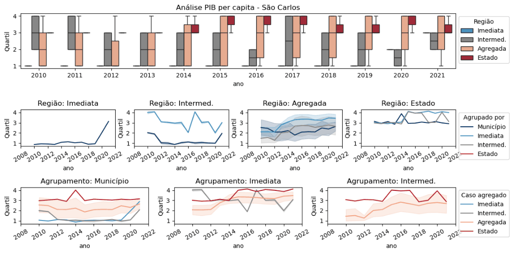
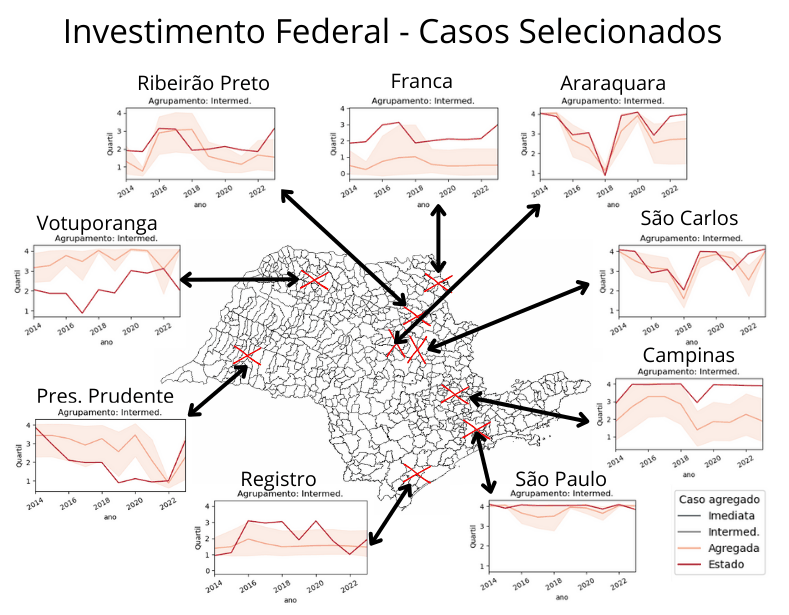

# Análise Tempo-Espacial

## Estudo de caso - São Carlos

### Analisando parâmetros importantes - Vizinhança de agregação e Domínio

São Carlos, Descalvado e Ibaté afundando barco, Matão destruíndo - foto de 2020, qual a variação ao longo do tempo?
 

### Relevância regional depende da perspectiva
  

 

## Expandindo a análise

### Explorando padrões à nivel Estadual e incluindo Investimentos Federais

 

### Considerando dimensão Temporal
 

  
   

a) Resultados PIB per capita dos municípios         b) Resultados Investimentos Federais
