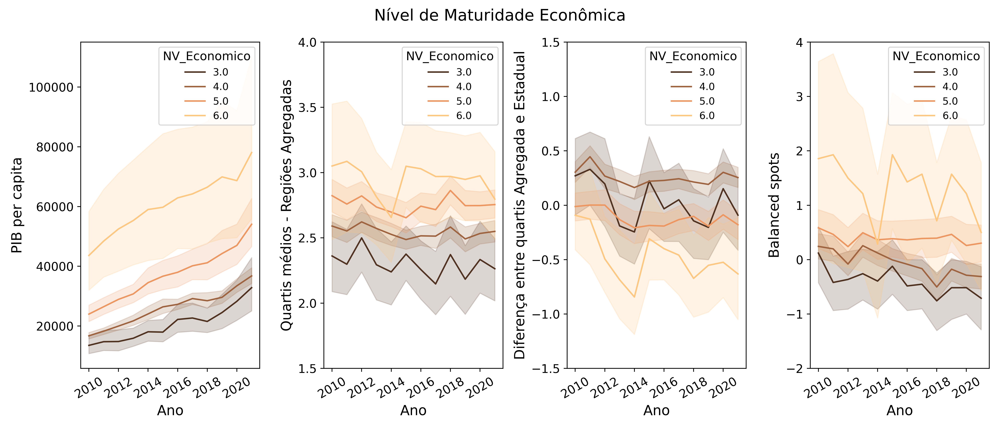
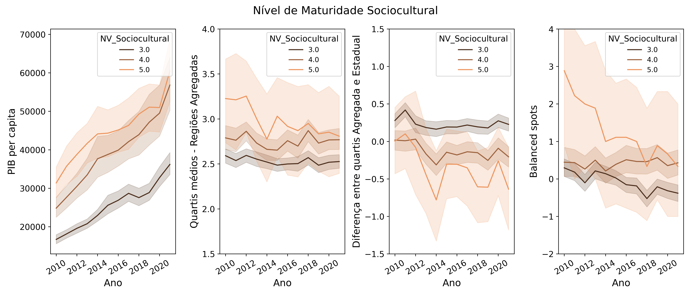

# Voltando ao contexto do Projeto - Nível de Maturidade dos municípios
A fim de comparar a capacidade de descrição do nível de maturidade das cidades, é criada uma visualização com a variável original (PIB *per capita*), e as estatísticas espaciais resultantes da análise anterior: os quartis regionais médios, o valor da diferença entre quartis considerando Domínio Estadual e R. Agregada e um índice criado a partir das contagens de *Hot/Cold spots* (cada valor de *Hot* equivale a +1, e *Cold* a -1, sendo feita a contagem total e soma dos valores). Em primeiro momento são analisadas as maturidades Econômica e Sociocultural. Uma segunda análise é feita considerando todos os tipos de maturidade, mas focando nas classes majoritarias.

## Relacionando estatísticas espaciais com Maturidade Econômica e Sociocultural

Conforme esperado, o PIB *per capita* em valores originais é um bom descritor do nível de Maturidade Econômica, promovendo boa separação dos casos. Aparentemente o uso de quartis médios e da ponderação de *Hot/Cold spots* proporciona uma melhor separação que a diferença entre quartis. Porém vale a ressalva que, as classes minoritárias (níveis 3 e 6) representam menos de 7% dos dados.
 

De forma similar para Maturidade Sociocultural, o PIB *per capita* em valores originais é um bom descritor. Porém nesse caso, o uso de quartis médios e a diferença entre quartis parecem separar melhor os dados. Vale a mesma ressalva, e a classe minoritária (nível 5) representa menos de 2% dos dados.

 

Para verificar como as estatísticas espaciais se comportam em relação às classes majoritárias, é feita a filtragem dos dados, com as proporções de cada uma das classes relacionadas abaixo. 

| Nível | Maturidade Econômica | Maturidade Sociocultural | Maturidade Ambiental | Maturidade Institucional |
|-------|-----------------------|--------------------------|-----------------------|--------------------------|
| 1     | -                     | -                        | 0.16%                 | -                        |
| 2     | -                     | -                        | 2.02%                 | **92.09%** ✅             |
| 3     | 5.12%                 | **68.06%** ✅            | **39.85%**  ✅       | **7.44%** ✅              |
| 4     | **61.71%** ✅         | **30.54%** ✅            | **57.67%** ✅         | -                        |
| 5     | **31.01%** ✅         | 1.40%                    | 0.31%                 | 0.16%                    |
| 6     | 2.17%                 | -                        | -                     | 0.31%                    |
| 7     | -                     | -                        | -                     | -                        |

## Focando nas classes majoritarias e incluindo Maturidades Ambiental e Institucional

É feita a codificação dos níveis através das cores das linhas, com níveis mais baixos em cores mais escuras e os mais altos mais claros. É mantida a constância da paleta ao longo dos gráficos, por coerência. NOta-se que Maturidade Econômica e Sociocultural são altamente correlacionadas, e todas as variáveis consideradas fazem uma boa separação das classes. Já no caso de Maturidade Ambiental, PIB *per capita* e quartis médios não conseguem separar cada nível satisfatoriamente, com o índice dos *Hot/Cold spots* sendo levemente melhor e a diferença entre quartis conseguindo uma boa discriminação. SItuação similar ocorre na Maturidade Institucional, porem com o *Balanced spots* separando melhor.

&nbsp;&nbsp;&nbsp;&nbsp;&nbsp;&nbsp;&nbsp;&nbsp;&nbsp;&nbsp;&nbsp;&nbsp;&nbsp;&nbsp;&nbsp;&nbsp; &nbsp;&nbsp;&nbsp;&nbsp;&nbsp;&nbsp;&nbsp;&nbsp;&nbsp;&nbsp;&nbsp;&nbsp;&nbsp;&nbsp;&nbsp;&nbsp;&nbsp;&nbsp;&nbsp;&nbsp;&nbsp;&nbsp; &nbsp;&nbsp;&nbsp;&nbsp;&nbsp;&nbsp;&nbsp;&nbsp;&nbsp;&nbsp;&nbsp;&nbsp;&nbsp;&nbsp;&nbsp; &nbsp;&nbsp;&nbsp;&nbsp;&nbsp;&nbsp;&nbsp;&nbsp;&nbsp;&nbsp;&nbsp;&nbsp; **Análise Temporal dos Quartis "Regionais"**
 

# Conclusão Quarta Etapa
É com satisfação que observa-se que o trabalho desenvolvido ao longo do projeto foi frutífero. As estatísticas espaciais derivadas da análise conseguem um bom poder de discriminação, por vezes melhores que a da variável original. Isso indica que, em certos cenários, a dinâmica de influência/relevância regional pode ter maior poder descritivo que o valor absoluto da variável em estudo. Por suposto, PIB *per capita* seria um bom descritor da Maturidade Econômica, mas nos casos não triviais (Maturidade Ambiental e Institucional), as relações regionais estudadas no presente projeto provaram seu valor ao transformar dados de outro domínio (econômico) para modelar relacões regionais, e com esses resultados discernir entre diferentes níveis de maturidade ambiental e instituicional.

 
