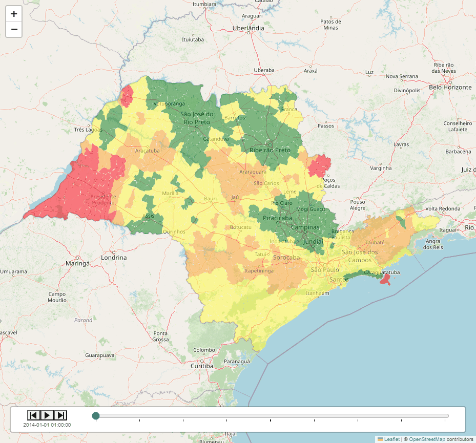
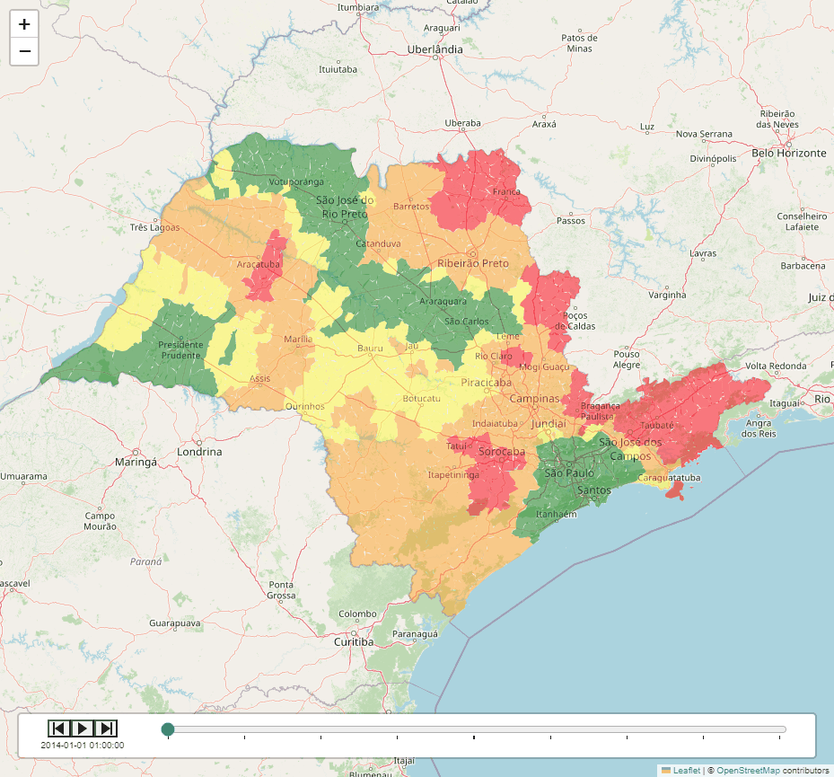

# Detalhamento da análise espacial

## Contextualização

## Exploratória dos dados de investimento (2014-2023)

Corresponde ao pagamento total (despesas do exercício pagas e restos a pagar pagos) dos grupos de natureza de despesa 4 (investimentos) e 5 (inversões financeiras), exceto as despesas financeiras, que compõem o Orçamento Fiscal e da Seguridade Social. Investimentos são despesas orçamentárias com softwares e com o planejamento e a execução de obras, inclusive com a aquisição de imóveis considerados necessários à realização destas últimas, e com a aquisição de instalações, equipamentos e material permanente. Inversões financeiras são despesas orçamentárias com a aquisição de imóveis ou bens de capital já em utilização; aquisição de títulos representativos do capital de empresas ou entidades de qualquer espécie, já constituídas, quando a operação não importe aumento do capital; e com a constituição ou aumento do capital de empresas, além de outras despesas classificáveis neste grupo. Os dados são obtidos a partir de consultas junto ao Sistema Integrado de Administração Financeira do Governo Federal – SIAFI.

fonte: https://dados.gov.br/dados/conjuntos-dados/investimento-publico

## Preview resultado da análise espacial

  <!-- First GIF -->
  

    <h3>GeoTemp PIB</h3>
    
  

  <!-- Second GIF -->
  

    <h3>GeoTemp Invest</h3>
    
  

  
   

