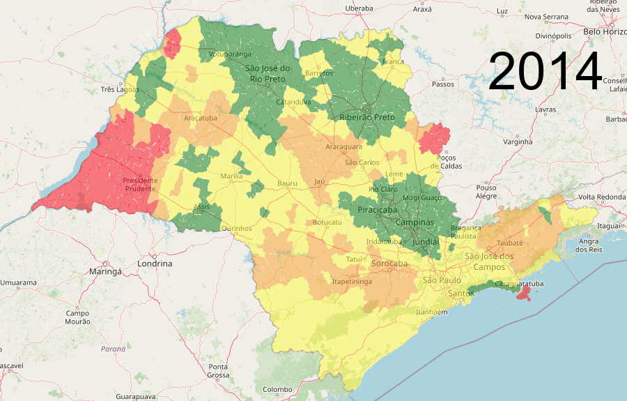
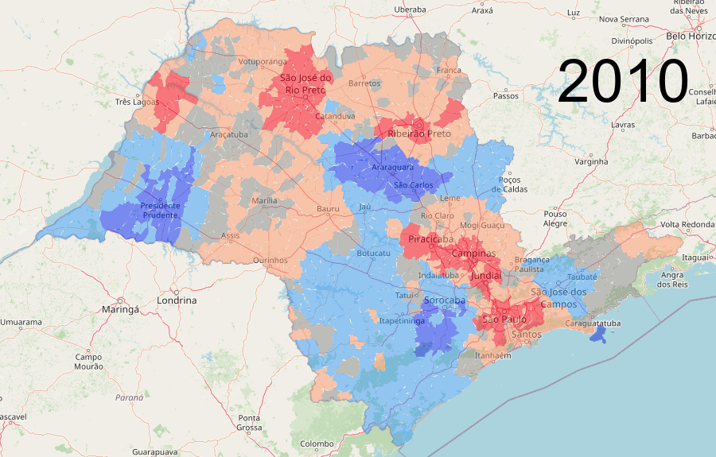

# Importação dos dados de Maturidade dos municípios da plataforma inteli.gente (MCTI)

Plataforma do Ministério da Ciência, Tecnologia e Inovação (MCTI) que define cidades inteligentes como:

"... **cidades comprometidas com o desenvolvimento urbano sustentável e a transformação digital**, em seus aspectos econômico, meio ambiente, sociocultural e de capacidade institucional, ... e **utilizam tecnologias para solucionar problemas concretos, criar oportunidades, oferecer serviços com eficiência, reduzir desigualdades,** aumentar a resiliência **e melhorar a qualidade de vida de todas as pessoas**, garantindo o **uso seguro e responsável de dados** e das tecnologias da informação e comunicação.**"

  

**fonte:** https://inteligente.mcti.gov.br/

# Detalhamento da análise espacial

## Contextualização
O projeto é dividido em 5 etapas, que são brevemente descritas como:
1.  **Análise exploratória e pré-processamento** : Detalha a coleta e descrição das bases escolhidas. As decisões de projeto relativas ao pré-processamento são descritas, e as visualizações iniciais que motivaram as próximas etapas são exibidas.
2.  **Qualidade da amostra** : Uma vez que é encontrado o desafio da esparsidade geográfica dos Investimentos, explora-se a representatividade das localidades que receberam investimentos em 2023 frente à totalidade dos municípios brasileiros.
3.  **Exploração biblioteca GIS - Pysal** : O objetivo inicial seria modelar a distribuição dos investimentos regionalmente. Para isso é escolhida a biblioteca Pysal, buscando explorar a dinâmica de influênia/relevância regional. Porém, o estudo da ferramenta levanta dúvidas quanto à viabilidade dessa abordagem, e é feita a decisão de estudar mais a fundo elementos que regem essa dinâmica de influência.
4.  **Dinâmica de Influência/Relevância regional**: É feita a descrição do experimento realizado, com pormenorização das considerações e conclusões. Destaca-se a importância da nova granularidade de vizinhança (denominada Região Agregada) para a análise espaço-temporal, uma vez que permite incluir diferentes perspectivas das localidades de interesse na análise.
5.  **Estatísticas Espaciais e Níveis de Maturidade**: É feita a relação entre as denominadas estatísticas espaciais obtidas no item anterior com as informações de Maturidade obtidas na primeira etapa. verifica-se que as estatística espaciais conseguem descrever de forma satisfatória cidades com diferentes níveis de maturidade, mesmo em casos em que a variável original falha na tarefa.

<!-- 
## Preview resultados - Modelagem da Influência/Relevância Regional dos Municípios

### Quanto a correlação entre PIB *per capita* e Investimento Federais ao longo dos anos
&nbsp;&nbsp;&nbsp;&nbsp;&nbsp;&nbsp;&nbsp;&nbsp;&nbsp;&nbsp;&nbsp;&nbsp;&nbsp;&nbsp;&nbsp;&nbsp; &nbsp;&nbsp;&nbsp;&nbsp;&nbsp;&nbsp; a) Resultados PIB *per capita*  dos municípios&nbsp;&nbsp;&nbsp;&nbsp;&nbsp;&nbsp;&nbsp;&nbsp;&nbsp;&nbsp;&nbsp;&nbsp;&nbsp;&nbsp;&nbsp;&nbsp;&nbsp;&nbsp;&nbsp;&nbsp;&nbsp;&nbsp;&nbsp;&nbsp;&nbsp;&nbsp;&nbsp;&nbsp;&nbsp;&nbsp;&nbsp;&nbsp; &nbsp;&nbsp;&nbsp;&nbsp;&nbsp;&nbsp;&nbsp;&nbsp;&nbsp;&nbsp;&nbsp;&nbsp;&nbsp;&nbsp;&nbsp;&nbsp; b) Resultados Investimentos Federais

  
   

### Métricas para quantificar Influência/Relevância Regional 
&nbsp;&nbsp;&nbsp;&nbsp;&nbsp;&nbsp;a) Resultados *Hot/Cold spots* considerando PIB *per capita* &nbsp;&nbsp;&nbsp;&nbsp;&nbsp;&nbsp;&nbsp;&nbsp;&nbsp;&nbsp;&nbsp;&nbsp;&nbsp;&nbsp;&nbsp;&nbsp;&nbsp;&nbsp;&nbsp;&nbsp;&nbsp;&nbsp;&nbsp;&nbsp; b) Resultados Diferença entre quartis **Agregada - Estadual**

  
   

# COnclusões do projeto e expectativas futura
O presente projeto começou com a expectativa de estudar como INvestimentos Federais influenciam o Nìvel da Maturidade Econômica (obtidos na plataforma Inteli.gente do Ministério da Ciência, Tecnologia e Inovação) dos municípios brasileiros. É verificado o desafio de que nem todos as localidades recebem investimentos, o que a princípio inviabilizaria a análise direta. Para lidar com esse obstáculo, levanta-se a suposição que os investimentos em uma cidade tem benefícios indiretos para seu entorno. Partindo dessa suposição, é feita uma análise quanto à representatividade da amostra (lugares que receberam investimentos em 2023) em relação à totalidade de cidades no Brasil. É verificado que o PIB *per capita* tem boa representatividade, e a estratégia traçada seria utilizar esse valor (que existe para todas as cidades) para modelar o efeito de distribuição regional local mencionado acima.

UM entrave para essa abordagem é a falta de domínio sobre a dinâmica de influência/relevância regional de cada cidade. Em dado momento é feita uma tentativa de distribuir os valores regionalmente, porém conclui-se que esse tipo de abordagem pode gerar "resultados", porém não há confiança quanto à qualidade destes, sendo passada a impressão que são somente números - não informação. Nesse ponto do desenvolvimento do projeto é feita a mudança de objetivo de pesquisa, sendo essa definida agora em continuar na investigação experimental de modelar influências regionais.

Essa etapa do projeto foi a mais desafiadora - e recompensadora. É utilizada uma ferramenta de GIS (Geographic Information System), implementada na biblioteca Pysal, para averiguar a dinâmica de relacionamentos espaciais. Após um estudo minuncioso dos recursos disponíveis, opta-se por conduzir a análise utilizando *Spatial Lag* (simplificadamente uma forma de regularização/suavização) e *Hot/COld spots* (que utiliza a estatística *I* de Moran para definir localidades de interesse). É desenhado um experimento extensivo sobre os impactos de escolha de Domínio (quantidade de municípios considerados) e Vizinhança para agrupamento (crucial para o cálculo de *Spatial Lag* ). É feita a proposta de uma nova granularidade de vizinhança para agregação, sendo denominada Região Agregada, que permite explorar diferentes perspectivas do mesmo município.

As conclusões dessa etapa são que a R. Agregada proposta como DOmínio conduz a resultados relevantes, e quando aliada à consideração de vizinhanças amplas (R. Intermediária do IBGE) obtem-se resultados coerentes para a modelagem de influência regional. Com os reusltados consolidados do experimento, para Investimentos Federais e PIB *per capita*, é viabilizada a investigação das relações regionais, sendo possível inferir polos regionais e observar a mudança de importancia de certas localidades. A correlação entre Invesitmentos e PIB *per capita* é verificada, de forma superficial, e pode ser explorada mais a fundo em trabalhos futuros. Por fim, verifica-se que as estatísticas espaciais conseguem boa discriminação do nível de Maturidade, mesmo em casos em que a variável original (PIB *per capita*) falha em separar as observações.

Nesse contexto, considera-se que a pesquisa teve resultados satisfatórios e além do esperado. Apesar de não concluir o objetivo inicial, foi possível desenvolver uma exploração da dinâmica de relevância regional, e trabalhos futuros podem aprofundar questões ocmo a correlação entre diferentes variáveis (relacionando PIB *per capita* com ocupação da população e investimentos), e com esse resultado em mão finalmente avançar sobre o desafio de modelar o efeito de benefícios indiretos na vizinhança para distribuir corretamente os valores de investimento regionalmente.

-->
